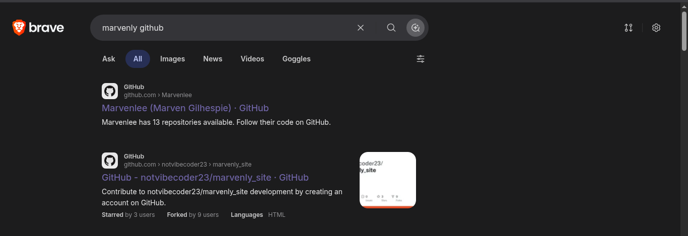

# 🛡️ Dev-Diaries Room Writeup

## 📋 Overview

This writeup documents the solution to the **Dev-Diaries** TryHackMe room. Unlike typical CTF challenges that provide an IP address directly, this room presents us with a domain name (`marvenly.com`) and requires us to leverage OSINT (Open Source Intelligence) techniques to discover subdomains, identify the developer, and uncover flags hidden in commit history.

---

## 🔍 Initial Reconnaissance: Finding the Target

### Challenge Overview
Upon entering the room, rather than being provided with a direct IP address (as is typical in TryHackMe), we receive a domain name: **marvenly.com**. This immediately signals that we'll need to employ domain enumeration and OSINT techniques.

### First Approach: DNS Resolution Testing
Our initial strategy was to perform DNS resolution to locate the live target. We attempted standard DNS query commands:

```bash
nslookup marvenly.com && dig marvenly.com
```

**Result:** Both commands failed to provide satisfactory results. Neither returned information about the live host, which was our first indication that direct DNS queries wouldn't work for this challenge.

### Trying the AttackBox
Next, we attempted to open the room in the TryHackMe AttackBox environment, hoping that the target might be accessible from within the VPN tunnel without encountering the common `DNS_PROBE_POSSIBLE` error that users sometimes face in browser environments.

### Discovering the VPN Subnet
The breakthrough came when we tested the VPN routes using:

```bash
ip route
```

This command revealed the subnet range in which the target could possibly exist:

```
10.48.0.0/12
```

### Attempting Network Scanning
With the subnet identified, we attempted to scan for live hosts using nmap:

```bash
nmap -sn 10.48.0.0/24
nmap -sn 10.49.0.0/24
nmap -sn 10.48.0.0/24
```

Unfortunately, these attempts didn't yield the expected results. This led us to pivot our approach entirely.

---

## 🌐 Question 1: Finding the Development Subdomain

### ❓ Question
> What is the subdomain where the development version of the website is hosted?

### 🔎 Investigation Process
Since traditional network reconnaissance wasn't working, we shifted to OSINT and certificate enumeration. We used **Censys** (an internet search engine for discovering devices and services connected to the internet) to search for information about the domain `marvenly.com`.

**Discovery:** The Censys search revealed **2 subdomains** associated with marvenly.com:
- **uat-testing.marvenly.com** (UAT = User Acceptance Testing environment)
- **admin.marvenly.com** (Admin panel)

### ✅ Answer
The development version of the website is hosted on: **`uat-testing.marvenly.com`**

This was the correct answer to the first question.

---

## 👤 Question 2: Identifying the Developer's GitHub Username

### ❓ Question
> What is the GitHub username of the developer?

### 🔎 Investigation Process
To find the developer's GitHub account, we performed a targeted search:

```
Search term: "marvenly github"
```



The search results displayed several GitHub profiles. Among the results, one profile stood out—it had:
- More interactions and contributions
- A username that closely matched the company/project name
- Activity that aligned with the development of marvenly.com

We selected the most relevant result based on these indicators.

### 💡 Method Explanation
When searching for developers or projects on GitHub, look for profiles that demonstrate:
- Consistent commit history
- Projects related to the target domain
- Recent activity (active development or recent contributions)
- Username alignment with the organization or project name

### ✅ Answer
Upon submitting the GitHub username we discovered, the answer was accepted—confirming that we had correctly identified the developer.

---

## 📧 Question 3: Extracting the Developer's Email Address

### ❓ Question
> What is the developer's email address?

### 🔎 Investigation Process
The developer's email address was embedded in GitHub commits. GitHub exposes the committer's email address in commit metadata. To access this detailed information, we used a clever technique:

**Pro Tip:** To view complete commit metadata including the developer's email, append `.patch` to the end of a GitHub commit URL.

For example:
```
GitHub Commit URL: https://github.com/user/repo/commit/COMMIT_HASH
Add .patch suffix: https://github.com/user/repo/commit/COMMIT_HASH.patch
```

This retrieves the raw patch file, which includes full commit metadata such as:
- Author name
- Author email address
- Commit message
- Detailed code changes

### 💡 Tip for Future Use
This `.patch` technique is invaluable when conducting OSINT investigations on GitHub. It bypasses the GitHub web interface and displays raw commit information, making it easier to extract metadata that might not be immediately visible on the standard commit view.

### ✅ Answer
Using this method, we extracted the developer's email address from a commit and submitted it as the answer to question 3. The answer was accepted.

---

## 📜 Question 4: Understanding the Reason for Source Code Removal

### ❓ Question
> What reason did the developer mention in the commit history for removing the source code?

### 🔎 Investigation Process
This question required deeper investigation into the repository's commit history. Here's our approach:

**Step 1:** Review all commits in the repository
- We identified that there were **4 commits** in total

**Step 2:** Analyze each commit using the diff view
- We examined each commit's changes in the GitHub commit diff interface
- We compared file states across commits to identify when the source code was removed

**Step 3:** Locate the critical commit
- The most recent commit in which source code was not present was: **`88baf1d`**
- This indicated that the code removal occurred in this commit

**Step 4:** Extract the commit message
The commit message for `88baf1d` contained the reason for removing the source code:

```
The project was marked as abandoned due to a payment dispute
```

### ✅ Answer
Submission of this commit message was accepted as the correct answer to question 4.

---

## 🚩 Question 5: Uncovering the Final Flag

### ❓ Question
> Find the flag hidden in the developer's work

### 🔎 Investigation Process
Following the commit history further, we discovered an earlier commit (prior to the source code removal) that contained important information.

In this earlier commit, the developer left a message indicating that they were **removing their signatures** from the code. However, in the signatures section of the code, they had embedded **a flag as an HTML comment**.

**Discovery Location:**
- File: Source code comments (HTML section)
- Type: HTML comment
- Content: The flag we were seeking

### ✅ Answer
This method of flag discovery highlights an important security principle: developers sometimes hide comments or metadata in their code that they assume will be stripped during deployment. By analyzing commit history and examining all file contents, we were able to locate this hidden flag.

---

## 🎓 Key Techniques Learned

| Technique | Use Case | Tool/Method |
|-----------|----------|------------|
| **Certificate Enumeration** | Find subdomains and domains | Censys, crt.sh |
| **GitHub OSINT** | Identify developers and information | GitHub search, profile analysis |
| **Commit Metadata Extraction** | Access detailed commit information | `.patch` suffix on GitHub URLs |
| **Commit History Analysis** | Track changes and find information | GitHub diff views, commit logs |
| **Code Comment Mining** | Discover hidden information | Manual code review, HTML source inspection |

---

## 📌 Summary

The **Dev-Diaries** room successfully demonstrates the importance of OSINT and commit history analysis in security assessments. Rather than traditional network penetration, this challenge required:

1. ✅ **Domain enumeration** using Censys
2. ✅ **GitHub reconnaissance** to identify the developer
3. ✅ **Commit metadata extraction** using the `.patch` technique
4. ✅ **Detailed commit analysis** to understand project history
5. ✅ **Code inspection** to locate hidden information

This room serves as an excellent reminder that sometimes the most valuable information is hiding in plain sight—in version control systems, commit messages, and code comments.

---

## 🏆 Resources & References

- **Censys:** https://censys.io/ - Internet search engine for scanning devices and certificates
- **GitHub OSINT:** GitHub search and profile analysis
- **TryHackMe:** https://tryhackme.com - Hands-on cybersecurity training platform

---

*Last Updated: 2026 | Room Difficulty: Easy/Intermediate | Techniques: OSINT, GitHub Reconnaissance, Commit Analysis*
