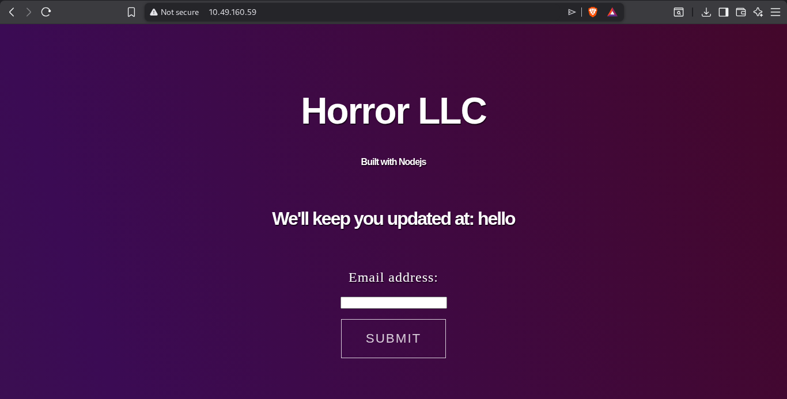

As i hit the ip in the browser this was our first look with the target



As i went through the source code i got the this js code 

```js
    document.getElementById("signup").addEventListener("click", function() {
	var date = new Date();
    	date.setTime(date.getTime()+(-1*24*60*60*1000));
    	var expires = "; expires="+date.toGMTString();
    	document.cookie = "session=foobar"+expires+"; path=/";
    	const Http = new XMLHttpRequest();
        console.log(location);
        const url=window.location.href+"?email="+document.getElementById("fname").value;
        Http.open("POST", url);
        Http.send();
	setTimeout(function() {
		window.location.reload();
	}, 500);
    }); 
```

As this code suggest us the below exploit to try.

- Broken authentication
- Client-side trust issues
- Parameter tampering
- Cookie manipulation

For the stuff of parameter injection i tried fuzzing for endpoints at http://10.48.144.111/FUZZ but returned with no output.

And since in the field subscibe for the newsletter enter email field shows  a text field and when somethingi is entered there and tap on submit it shows as on the same pageas

We'll keep you updated at : <entered text>

Now each time we hit submit it req to a parameter http://10.48.144.111/?email=<Entered Text>

So as per our attacker mindset i tried there for lfi. But not succeded so i interad try
