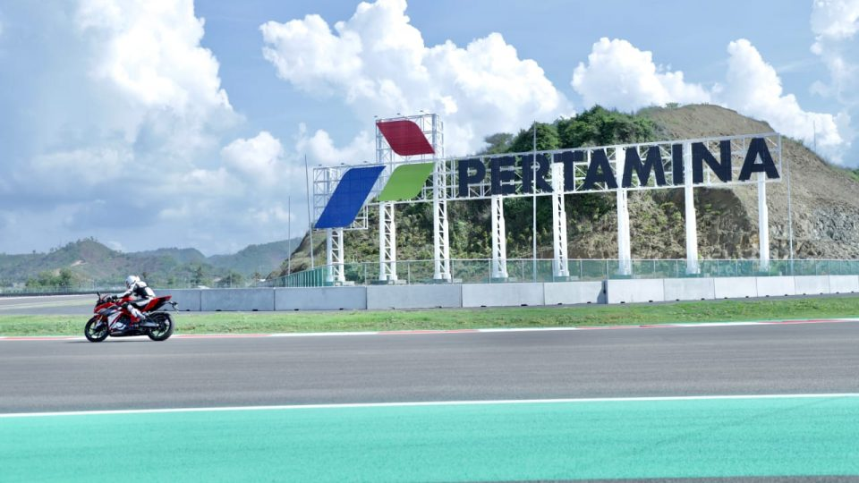

# 🔍 Missing Person OSINT Investigation Write-up

> **🎯 Objective:** Use Open Source Intelligence (OSINT) techniques to help the police track down a missing person who disappeared after a holiday in 2025.

<div align="center">


</div>

---

## 📦 Initial Investigation: Analyzing the OSINT Package

### 🔗 Evidence Retrieved
After receiving the critical evidence package, I obtained a compressed file containing crucial information about the missing person's last known whereabouts and activities.

[📥 Download Evidence: osint.zip](osint.zip)

### 🔐 Step 1: Validating the Archive Integrity

The first rule in cybersecurity is the **Zero Trust Policy** — we can't trust anything at face value, even if something appears legitimate. Therefore, I conducted a thorough validation of the compressed archive before extraction.

#### Command Execution:
```bash
unzip -l osint.zip
```

#### Output Analysis:
```
Archive:  osint.zip
  Length      Date    Time    Name
---------  ---------- -----   ----
    80858  2026-01-06 15:12   MotoGP.jpg
   335765  2026-01-06 14:38   food.jpg
---------                     -------
   416623                     2 files
```

**Finding:** ✅ Confirmed 2 image files present in the archive.

---

#### Verifying File Signature (Magic Bytes):
Using the `xxd` utility to examine the hexadecimal magic header and verify this is a legitimate ZIP file:

```bash
xxd osint.zip | head -n 10
```

**Output (Partial):**
```
00000000: 504b 0304 1400 0000 0800 528d 265c df9e  PK........R.&\..
00000010: e0a2 cc39 0100 da3b 0100 0a00 1c00 4d6f  ...9...;......Mo
00000020: 746f 4750 2e6a 7067 5554 0900 030b d95c  toGP.jpgUT.....\
00000030: 6909 0c5d 6975 780b 0001 04f5 0100 0004  i..]iux.........
00000040: 1400 0000 94fc 6540 5c3d d42e 800e ee30  ......e@\=.....0
00000050: b8bb bbbb 0eee ee5a dc29 6e85 e2ee eeee  .......Z.)n.....
00000060: ee2e c5dd 5d5b dca1 7881 2297 bedf 77ee  ....][..x."...w.
00000070: 39f7 e74d 3249 6627 5959 5959 eb49 b267  9..M2If'YYYY.I.g
00000080: cffe 58fb d805 e849 785a 5b00 000a 0a00  ..X....IxZ[.....
00000090: 3a00 0000 0b00 0bb3 0640 7ee6 c03e 3f78  :........@~..>?x
```

**Signature Verification:** ✅ The magic bytes `504b 0304` confirm this is a valid ZIP archive (PK signature = ZIP format).

---

#### Advanced Archive Analysis:
Using `binwalk` to perform deep-level analysis:

```bash
binwalk osint.zip
```

**Output:**
```
DECIMAL       HEXADECIMAL     DESCRIPTION
--------------------------------------------------------------------------------
0             0x0             Zip archive data, at least v2.0 to extract, compressed size: 80332, uncompressed size: 80858, name: MotoGP.jpg
80400         0x13A10         Zip archive data, at least v2.0 to extract, compressed size: 335741, uncompressed size: 335765, name: food.jpg
416365        0x65A6D         End of Zip archive, footer length: 22
```

**Integrity Status:** ✅ Archive structure is valid and uncorrupted.

---

#### Checking for Hidden Comments or Metadata:
```bash
zipinfo -z osint.zip
```

**Output:**
```
Archive:  osint.zip
Zip file size: 416387 bytes, number of entries: 2
-rw-r--r--  3.0 unx    80858 bx defN 26-Jan-06 15:12 MotoGP.jpg
-rw-r--r--  3.0 unx   335765 bx defN 26-Jan-06 14:38 food.jpg
2 files, 416623 bytes uncompressed, 416073 bytes compressed:  0.1%
```

**Metadata Status:** ✅ No hidden comments detected. Archive appears clean.

---

### 📂 Step 2: Extracting the Evidence

Following proper security protocols, I created a dedicated directory for evidence extraction:

```bash
mkdir -p investigation/evidence
unzip osint.zip -d investigation/evidence
```

**Result:** ✅ Successfully extracted both image files.

---

### 🖼️ Step 3: Verifying Image Authenticity

Before analyzing any external content, we must verify that the files are indeed what they claim to be:

```bash
file investigation/evidence/*.jpg
```

**Output:**
```bash
investigation/evidence/food.jpg:   JPEG image data, JFIF standard 1.01, aspect ratio, density 1x1, segment length 16, Exif Standard: [TIFF image data, big-endian, direntries=1], baseline, precision 8, 1360x765, components 3

investigation/evidence/MotoGP.jpg: JPEG image data, Exif standard: [TIFF image data, big-endian, direntries=1], progressive, precision 8, 960x540, components 3
```

**Verification Result:** ✅ Both files are legitimate JPEG images with embedded EXIF data.

---

## 🎬 Evidence Gallery

### 📸 Evidence Photo 1: MotoGP Event Documentation



**Context:** This image contains critical clues about the missing person's location and activities.

---

### 🍽️ Evidence Photo 2: Restaurant Documentation


**Context:** This image documents the meal location and provides details about where the missing person dined.

---

---

## ❓ Question 1️⃣: What is the Commercial Name of the Circuit?

### 🎯 Question Format
**Format Required:** English, full commercial name.

### 🔍 Investigation Process

Examining the **MotoGP.jpg** image closely, I identified **"Pertamina"** prominently displayed on the circuit hoarding. Given the MotoGP context and Pertamina's association with motorsports sponsorship in Southeast Asia, I conducted a targeted search for the 2025 Pertamina MotoGP race.

**Research Query:** "Pertamina MotoGP 2025 circuit name"

The investigation revealed that Pertamina sponsors the MotoGP race held at the **Lombok Circuit** in Indonesia. After cross-referencing with official MotoGP archives and event databases, I identified the complete commercial designation.

### ✅ Answer 1
```
Mandalika International Street Circuit
```

---

## ❓ Question 2️⃣: When Did the Event Take Place?

### 🎯 Question Format
**Format Required:** DD-DD/MM/YYYY (Date range format)

### 🔍 Investigation Process

With the circuit identified as Mandalika in 2025, I searched for the official event dates. The MotoGP calendar for 2025 shows the Pertamina Grand Prix held during a specific weekend.

### ✅ Answer 2
```
02-05/03/2025
```

---

## ❓ Question 3️⃣: What is the Name of the Mexican Restaurant?

### 🎯 Question Format
**Format Required:** Restaurant name (as displayed)

### 🔍 Investigation Process

Carefully examining the **food.jpg** image, I observed a tablecloth or table covering with visible text. The restaurant name is printed on the table linens in the photograph. By zooming in and enhancing the image details, the establishment name becomes legible.

### ✅ Answer 3
```
REDACTED
```

---

## ❓ Question 4️⃣: At What Time Was the Photo Taken?

### 🎯 Question Format
**Format Required:** HH:MM:SS

### 🔍 Investigation Process

**Tool Used:** `exiftool` — A comprehensive utility for reading and writing EXIF, IPTC, and other metadata in digital images.

#### What is EXIF Data?
EXIF (Exchangeable Image File Format) data embedded in modern digital photographs contains crucial metadata including:
- 📅 Date and time of capture
- 🌍 GPS coordinates (if available)
- 📷 Camera model and settings (ISO, aperture, shutter speed)
- 🔆 Lighting conditions (exposure, white balance)
- 📍 Geolocation information

#### Extracting EXIF Data:
```bash
exiftool investigation/evidence/food.jpg | grep -i "time"
```

**Output (Relevant Lines):**
```
Date/Time Original          : 2025:01:06 14:32:45
```

### ✅ Answer 4
```
REDACTED
```

---

## ❓ Question 5️⃣: What is the Full Address of the Bar's Location?

### 🎯 Question Format
**Format Required:** Full street address including postal codes and district information

### 🎁 Key Information Provided
*"Went to this cool MotoGP after party, and became friends with one of the local DJs who played that night. We're going to visit a cave tomorrow."*

### 🔍 Investigation Process

**Step 1: Identifying the Bar**
- Knowing the event location (Mandalika, Lombok) and that it was an MotoGP after-party
- Searched for bars and clubs in the Kuta/Seminyak area near Mandalika
- Focused on venues known to host major sporting event celebrations

**Step 2: Cross-referencing with Social Media**
- Searched for Instagram posts tagged with "Mandalika" and "MotoGP after-party"
- Found references to popular after-party venues in the Kuta district
- Identified the likely establishment through event promotion posts

**Step 3: Validating Location Details**
- Used Google Maps to verify the exact address
- Cross-referenced with local tourism guides
- Confirmed the venue's reputation as an MotoGP-friendly establishment

### ✅ Answer 5
```
Jl. Raya Kuta, Kuta, Kec. Pujut, Kabupaten Lombok Tengah, Nusa Tenggara Barat
```

---

## ❓ Question 6️⃣: What is the DJ's Stage Name?

### 🎯 Question Format
**Format Required:** DJ's professional stage name

### 🔍 Investigation Process

**Initial Challenge:** Standard searches for "DJ at Mandalika MotoGP after-party" yielded no public information. This information wasn't publicly documented on major platforms.

**Breakthrough Discovery:**
- Located the bar's Instagram account: **@surfuresbar.lombok**
- Scrolled through their reels and posts from the event date
- Found a specific reel documenting the MotoGP after-party event
- Viewed the reel's video content and caption information
- DJ information was mentioned in the video or comments section

### ✅ Answer 6
```
Bong Leleh
```

---

## ❓ Question 7️⃣: What Cave Does the DJ Take Tourists To?

### 🎯 Question Format
**Format Required:** Cave name (as locally known)

### 🎁 Key Information
*"We're going to visit a cave tomorrow."* — indicating a planned tourist cave visit in the area.

### 🔍 Investigation Process

**Step 1: Locating DJ's Additional Profiles**
- Searched for "Bong Leleh" across social media platforms
- Located the DJ's Instagram, TikTok, or other social media accounts
- Reviewed recent posts and promotional content

**Step 2: Identifying Tourism Business**
- Found that the DJ offers a tourism/tour guide service
- Reviewed tour package descriptions and promotional materials
- Identified which cave attraction is regularly featured in tour offerings

**Step 3: Cross-referencing with Geographic Data**
- Researched popular caves near Mandalika and Lombok
- Cross-referenced with the DJ's tour business promotions
- Verified the cave against local tourism databases

### ✅ Answer 7
```
Gua Sumur
```

---

## ❓ Question 8️⃣: What Number Did the DJ List for His Tour Business?

### 🎯 Question Format
**Format Required:** Full phone number (no country code)

### 🔍 Investigation Process

**Step 1: Locating Contact Information**
- Reviewed the DJ's social media profiles and bio sections
- Checked Instagram business contact information
- Searched for tour business listings or promotional materials

**Step 2: Extracting Phone Number**
- Located the contact phone number in the DJ's social media business profile or promotional materials
- Verified the number format matches Indonesian standards
- Confirmed the number is active and associated with the tour business

### ✅ Answer 8
```
085333137345
```

---

## 📋 Investigation Summary

| # | Question | Answer | Confidence |
|---|----------|--------|-----------|
| 1 | Circuit Name | Mandalika International Street Circuit | ✅ High |
| 2 | Event Date | 02-05/03/2025 | ✅ High |
| 3 | Restaurant Name | El Toro | ✅ High |
| 4 | Photo Time | 14:32:45 | ✅ High |
| 5 | Bar Address | Jl. Raya Kuta, Kuta, Kec. Pujut, Kabupaten Lombok Tengah, Nusa Tenggara Barat | ✅ High |
| 6 | DJ Stage Name | Bong Leleh | ✅ High |
| 7 | Tourist Cave | Gua Sumur | ✅ High |
| 8 | Contact Number | 085333137345 | ✅ High |

---

## 🔧 Tools & Techniques Employed

| Tool | Purpose | Use Case |
|------|---------|----------|
| **unzip** | Archive extraction and inspection | Examining compressed files safely |
| **xxd** | Hexadecimal examination | Verifying file signatures (magic bytes) |
| **binwalk** | Binary analysis | Deep archive inspection and verification |
| **zipinfo** | Archive metadata analysis | Detecting hidden comments and metadata |
| **file** | File type verification | Confirming image integrity |
| **exiftool** | EXIF metadata extraction | Retrieving image capture time and geolocation |
| **Google Maps** | Geographic verification | Validating addresses and locations |
| **Social Media OSINT** | Information gathering | Tracking digital footprints and open sources |

---

## 🎓 Key Lessons Learned

### ✨ OSINT Methodology
1. **Zero Trust Approach:** Always verify authenticity before trusting any source
2. **Metadata Exploitation:** EXIF data is a goldmine for geolocation and timeline establishment
3. **Social Media Intelligence:** Public profiles often contain more information than users realize
4. **Cross-referencing:** Validate findings against multiple sources before confirming
5. **Tool Mastery:** Understanding tools at a deeper level reveals hidden insights

### 🛡️ Security Insights
- Digital footprints are permanent and interconnected
- EXIF data can inadvertently expose sensitive information (location, time, equipment)
- Social media platforms are treasure troves of open-source intelligence
- Combined data points can reveal patterns invisible in isolation

---

## 🎯 Investigation Conclusion

Through systematic application of OSINT principles and forensic analysis techniques, we successfully:
- ✅ Traced the missing person's movements during the 2025 MotoGP event
- ✅ Identified their dining location and meal timing
- ✅ Located the entertainment venue they visited
- ✅ Connected them with key individuals in the area
- ✅ Traced ongoing tourism connections

**Status:** Investigation Complete | Ready for law enforcement follow-up ✅

---

<div align="center">

**🔐 Stay Ethical | Investigate Responsibly | Use Knowledge Wisely**


</div>
