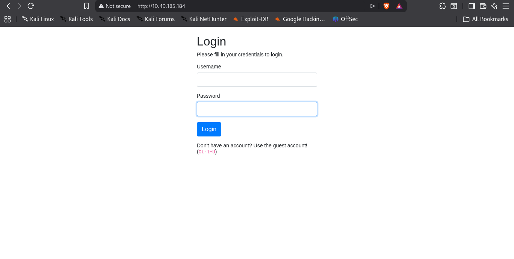
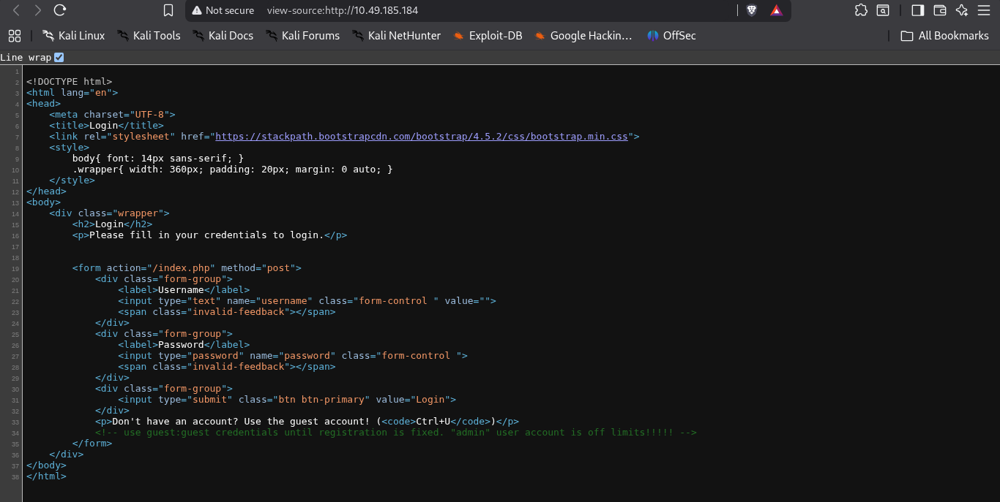
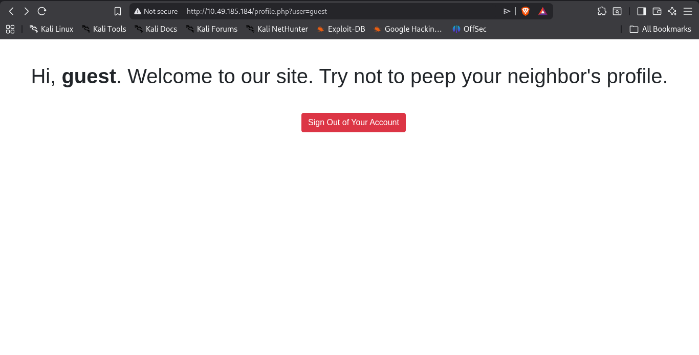

A quick hit in the browser at `http://10.49.185.184`.

It gave us a login page.

The login page hinted us to press **Ctrl+U** to view the page source.

Here is the source code.

As we can see on line 34, we have the credentials for the guest user.

After logging in with the guest account, it shows:

Consider the URL: `http://10.49.185.184/profile.php?user=guest`

Since this room is about **IDOR**, it is natural to try parameter tampering.

After trying a bunch of values for the `user` parameter, setting the value to `admin` revealed the flag. 🎉

Easiest flag ever caught!
