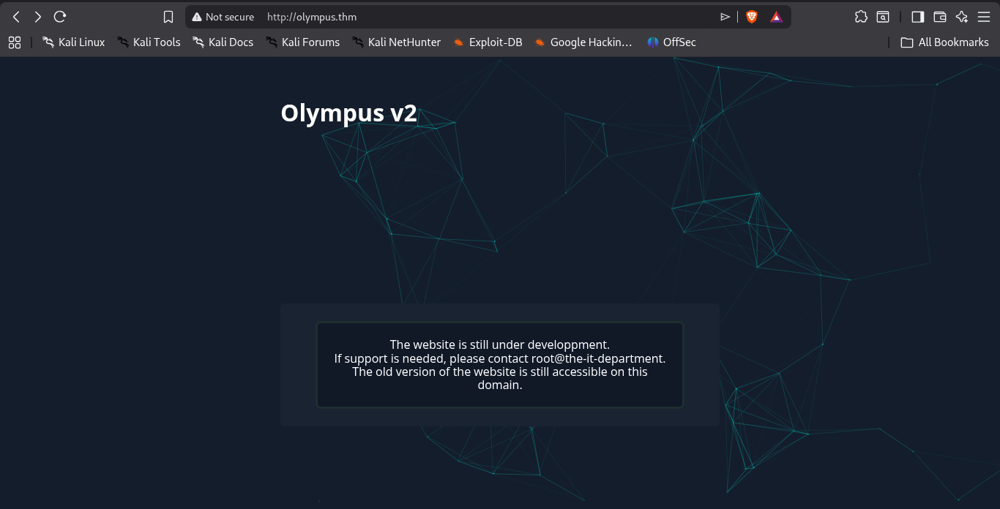
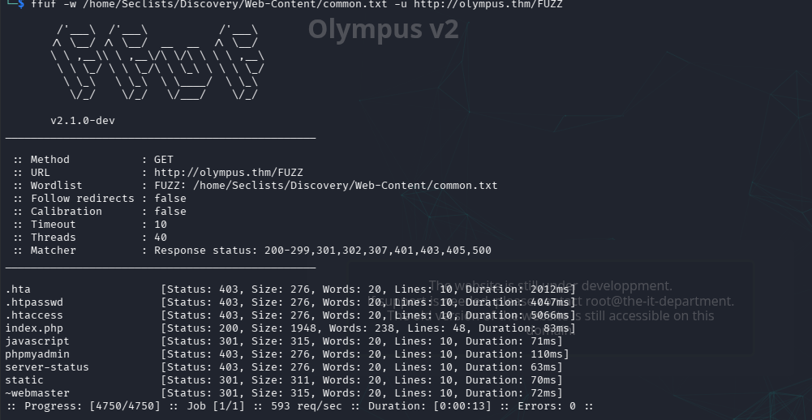
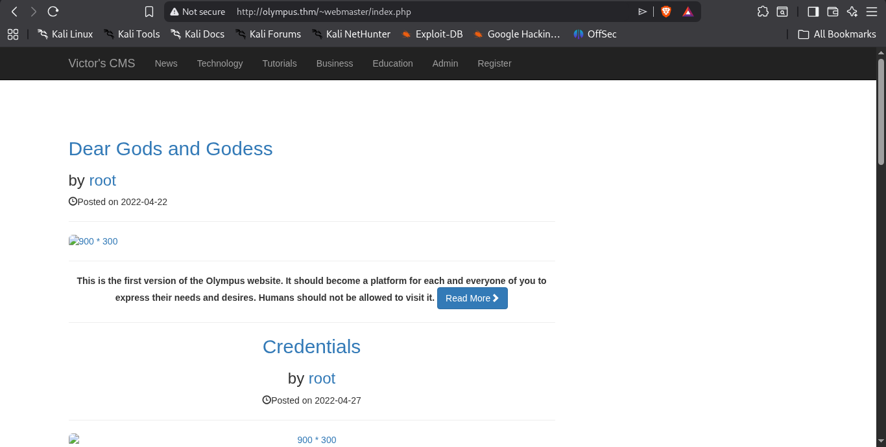

After getting the ip and opening it into the new page this was our first look of the target



the nmap result was 

```
Starting Nmap 7.98 ( https://nmap.org ) at 2026-04-26 14:32 +0530
Nmap scan report for olympus.thm (10.48.164.66)
Host is up (0.062s latency).
Not shown: 998 closed tcp ports (reset)
PORT   STATE SERVICE VERSION
22/tcp open  ssh     OpenSSH 8.2p1 Ubuntu 4ubuntu0.13 (Ubuntu Linux; protocol 2.0)
| ssh-hostkey: 
|   3072 24:c9:a1:2a:a4:64:90:7f:7b:ce:7c:98:e3:18:aa:f8 (RSA)
|   256 99:84:13:0f:8f:df:7c:b7:f3:df:64:24:b0:48:fc:31 (ECDSA)
|_  256 ec:db:7d:9b:e8:9d:a1:35:35:1d:2c:0e:bc:79:62:48 (ED25519)
80/tcp open  http    Apache httpd 2.4.41 ((Ubuntu))
|_http-server-header: Apache/2.4.41 (Ubuntu)
|_http-title: Olympus
No exact OS matches for host (If you know what OS is running on it, see https://nmap.org/submit/ ).
TCP/IP fingerprint:
OS:SCAN(V=7.98%E=4%D=4/26%OT=22%CT=1%CU=43846%PV=Y%DS=3%DC=T%G=Y%TM=69EDD4D
OS:C%P=x86_64-pc-linux-gnu)SEQ(SP=102%GCD=1%ISR=10D%TI=Z%CI=Z%II=I%TS=A)SEQ
OS:(SP=103%GCD=1%ISR=10C%TI=Z%CI=Z%TS=A)SEQ(SP=104%GCD=1%ISR=107%TI=Z%CI=Z%
OS:II=I%TS=A)SEQ(SP=104%GCD=1%ISR=10E%TI=Z%CI=Z%II=I%TS=A)SEQ(SP=105%GCD=2%
OS:ISR=10A%TI=Z%CI=Z%TS=A)OPS(O1=M4E8ST11NW7%O2=M4E8ST11NW7%O3=M4E8NNT11NW7
OS:%O4=M4E8ST11NW7%O5=M4E8ST11NW7%O6=M4E8ST11)WIN(W1=F4B3%W2=F4B3%W3=F4B3%W
OS:4=F4B3%W5=F4B3%W6=F4B3)ECN(R=Y%DF=Y%T=40%W=F507%O=M4E8NNSNW7%CC=Y%Q=)T1(
OS:R=Y%DF=Y%T=40%S=O%A=S+%F=AS%RD=0%Q=)T2(R=N)T3(R=N)T4(R=Y%DF=Y%T=40%W=0%S
OS:=A%A=Z%F=R%O=%RD=0%Q=)T5(R=Y%DF=Y%T=40%W=0%S=Z%A=S+%F=AR%O=%RD=0%Q=)T6(R
OS:=Y%DF=Y%T=40%W=0%S=A%A=Z%F=R%O=%RD=0%Q=)T7(R=Y%DF=Y%T=40%W=0%S=Z%A=S+%F=
OS:AR%O=%RD=0%Q=)U1(R=Y%DF=N%T=40%IPL=164%UN=0%RIPL=G%RID=G%RIPCK=G%RUCK=G%
OS:RUD=G)IE(R=Y%DFI=N%T=40%CD=S)

Network Distance: 3 hops
Service Info: OS: Linux; CPE: cpe:/o:linux:linux_kernel

```
After doing a directory enumuration with the command 

```
ffuf -w /home/Seclists/Discovery/Web-Content/common.txt -u http://olympus.thm/FUZZ -ac
```

there are the endpoints



When entering into the page http://olympus.thm/~webmaster

There is this page and this page alone give me many page.



here are the endpoints that i found from that page

```http
1.http://olympus.thm/~webmaster/index.php
2.
```
