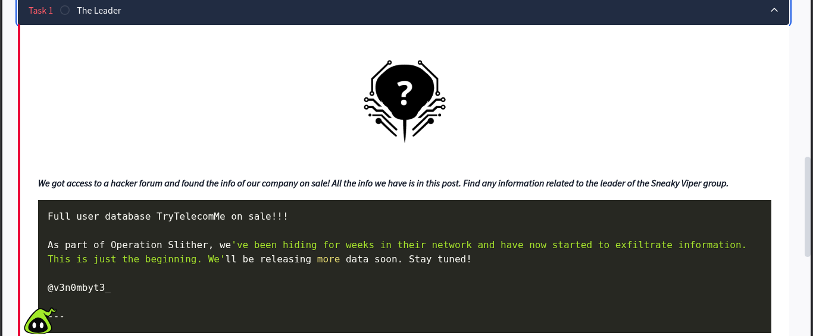

In this room we have given no ip no target just paragraph and answer from it.



So here it is saying that they have got a access to a hacker forum and its about the group

Sneaky viper group

and room is telling us to find the leader of this group 


That is the info they could get from the forum


```
Full user database TryTelecomMe on sale!!!

As part of Operation Slither, we've been hiding for weeks in their network and have now started to exfiltrate information. 
This is just the beginning. We'll be releasing more data soon. Stay tuned!

@v3n0mbyt3_

---

```
And they give us this reconnaissance guide

```
- Begin with the provided username and perform a broad search across common social platforms.

- Correlate discovered profiles to confirm ownership and authenticity.

- Review interactions, posts, and replies for potential leads.

```
since it is clearly said to find common socail platform for the username @v3n0mbyt3_

And in the quesiton

```
Aside from Twitter / X, what other platform is used by v3n0mbyt3_? Answer in lowercase.
```

It is already to said ignore Twitter / X. answer is of 7 char.

So we find some common social platform and see whose name is of 7 char.

- Twitter
- Discord
- YouTube
- Threads
- MySpace

i tried and succeed at threads.
