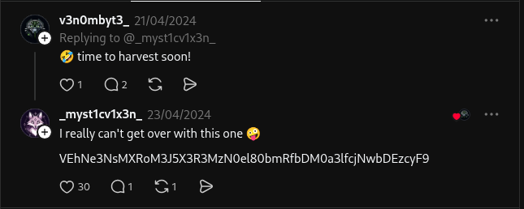

In this room we have given no ip no target just paragraph and answer from it.


The company name: trytelecomMe

So here it is saying that they have got a access to a hacker forum and its about the group

Sneaky viper group

and room is telling us to find the leader of this group 


That is the info they could get from the forum


```
Full user database TryTelecomMe on sale!!!

As part of Operation Slither, we've been hiding for weeks in their network and have now started to exfiltrate information. 
This is just the beginning. We'll be releasing more data soon. Stay tuned!

@v3n0mbyt3_

---

```
And they give us this reconnaissance guide

```
- Begin with the provided username and perform a broad search across common social platforms.

- Correlate discovered profiles to confirm ownership and authenticity.

- Review interactions, posts, and replies for potential leads.

```
since it is clearly said to find common socail platform for the username @v3n0mbyt3_

And in the quesiton

```
Aside from Twitter / X, what other platform is used by v3n0mbyt3_? Answer in lowercase.
```

It is already to said ignore Twitter / X. answer is of 7 char.

So we find some common social platform and see whose name is of 7 char.

- Twitter
- Discord
- YouTube
- Threads
- MySpace

i tried and succeed at threads.

Now we will goto threads social site and do some enumuration on this profile as per said in reconnaissance instruciton and will find the answer of q2.

```
What is the value of the flag?
```

When using the gui and tapped on search and find the username with @ included i was not able to find so i quickly attach the username into the url as 

[ventoy](https://www.threads.com/@v3n0mbyt3_)

I went throught the threads and i need to make a account to go throught all the enumuation after seeing each like each comment each post each comment on his post by him his mentions

when i opened his replies tab of threads. i saw something suspicious



So since it looks like a cipher text so i grabled it.

```VEhNe3NsMXRoM3J5X3R3MzN0el80bmRfbDM0a3lfcjNwbDEzcyF9```

And put it into my [cybersecurity Calcularot](https://github.com/212-del/CyberSecurity-Calculator.git) and using the option 2 it tell me quickly that its is base64.

And after decoding it with my [cybersecurity Calcularot](https://github.com/212-del/CyberSecurity-Calculator.git) option to decode for base64.

I got the flag and in this way q2 solves.

lets get onto the 3rd quesiton.

it asked that 

```
What is the username of the second operator talking to v3n0mbyt3 from the previous platform?
```

Now in the replies tab of venom we can see it reply only to @_myst1cv1x3n_

So clealry this is our answer.

lets ge onto the 4th question it sas what is the value of the falg.

As we were given some reconnasaince guidance too in this field too.

- Use related usernames or connections identified in earlier steps to expand reconnaissance.

- Enumerate additional platforms for linked accounts and shared content.

- Follow media or resource references across platforms to trace information flow.

So i tried finding _myst1cv1x3n_ on other social platform then i found its account on instagram and when i opened its 1 reel and see the commnads the flag was there 

it was the [reel](https://www.instagram.com/reel/C6BuP1CNMCI/)


Lets  now move onto the part 3 last part with q5, q6, q7

Now for q6 it is aksed for 

```
What other platform does the third operator use? Answer in lowercase.

```

answer is of 6 char so after a lot of name guess i finally landed at gihub and it was true.

and the reconnaisance guide in this are

- Identify secondary accounts through visible interactions (likes, follows, collaborations).

- Extend reconnaissance into developer or technical platforms associated with the identity.

- Analyse activity history (such as repositories or commits) for embedded information.

