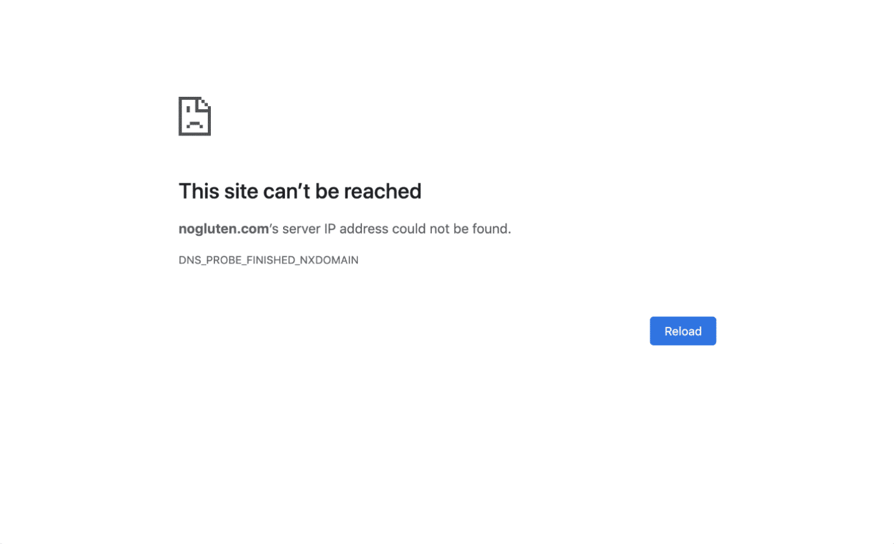
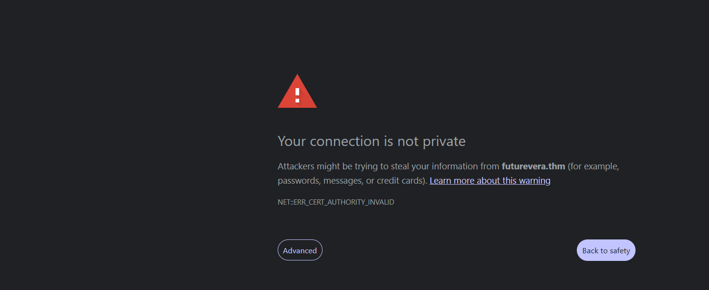
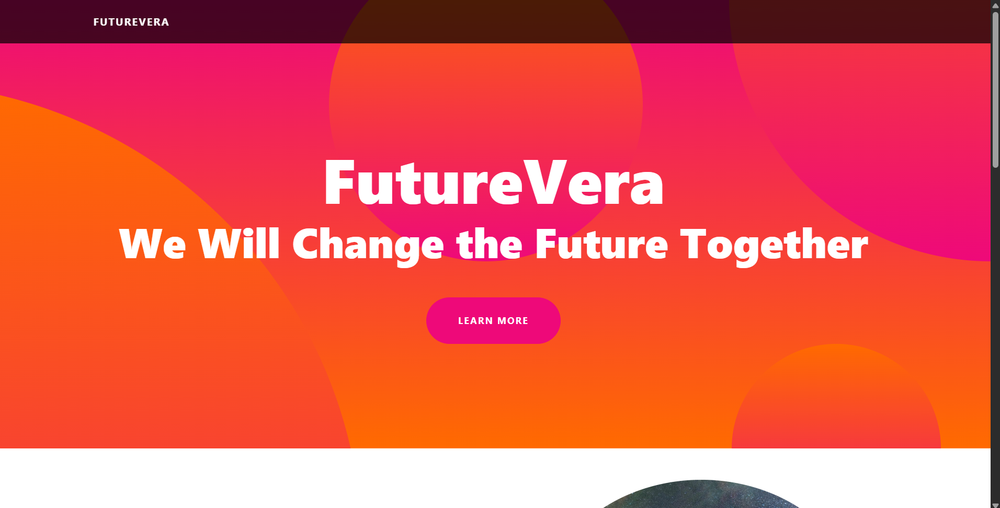
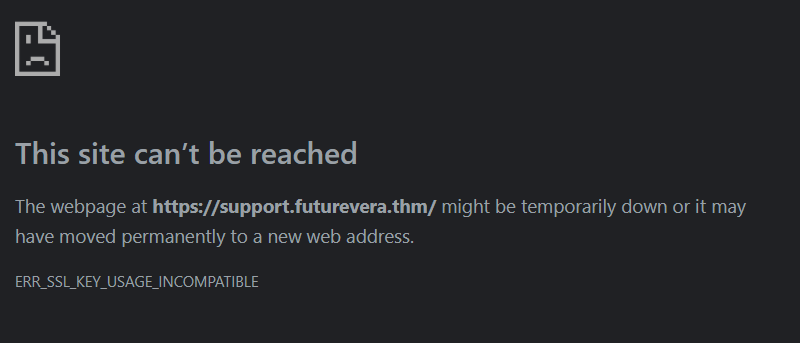

At the beginning of the room, we obtained the IP address 10.48.189.76. When I visited http://10.48.189.76/

What I got was:



To resolve this error, we need to add the domain (shown in the picture above) beside the IP in the `/etc/hosts` file.

After resolving, this is our target:



It's because its certificate has expired.

After clicking on **Advanced**, we get our first look at the target.



And here is the source code:

```html
<!DOCTYPE html>
<html lang="en">
    <head>
        <meta charset="utf-8" />
        <meta name="viewport" content="width=device-width, initial-scale=1, shrink-to-fit=no" />
        <meta name="description" content="" />
        <meta name="author" content="" />
        <title>FutureVera</title>
        <link rel="icon" type="image/x-icon" href="assets/favicon.ico" />
        <link href="css/styles.css" rel="stylesheet" />
    </head>
    <body id="page-top">
        <!-- Navigation-->
        <nav class="navbar navbar-expand-lg navbar-dark navbar-custom fixed-top">
            <div class="container px-5">
                <a class="navbar-brand" href="#page-top">FutureVera</a>
                <button class="navbar-toggler" type="button" data-bs-toggle="collapse" data-bs-target="#navbarResponsive" aria-controls="navbarResponsive" aria-expanded="false" aria-label="Toggle navigation"><span class="navbar-toggler-icon"></span></button>
            </div>
        </nav>
        <!-- Header-->
        <header class="masthead text-center text-white">
            <div class="masthead-content">
                <div class="container px-5">
                    <h1 class="masthead-heading mb-0">FutureVera</h1>
                    <h2 class="masthead-subheading mb-0">We Will Change the Future Together</h2>
                    <a class="btn btn-primary btn-xl rounded-pill mt-5" href="#scroll">Learn More</a>
                </div>
            </div>
            <div class="bg-circle-1 bg-circle"></div>
            <div class="bg-circle-2 bg-circle"></div>
            <div class="bg-circle-3 bg-circle"></div>
            <div class="bg-circle-4 bg-circle"></div>
        </header>
        <!-- Content section 1-->
        <section id="scroll">
            <div class="container px-5">
                <div class="row gx-5 align-items-center">
                    <div class="col-lg-6 order-lg-2">
                        <div class="p-5"></div>
                    </div>
                    <div class="col-lg-6 order-lg-1">
                        <div class="p-5">
                            <h2 class="display-4">Space is the future</h2>
                            <p>Mankind's survival into the far future will very likely require extensive space colonization.</p>
                        </div>
                    </div>
                </div>
            </div>
        </section>
        <!-- Content section 2-->
        <section>
            <div class="container px-5">
                <div class="row gx-5 align-items-center">
                    <div class="col-lg-6">
                        <div class="p-5"></div>
                    </div>
                    <div class="col-lg-6">
                        <div class="p-5">
                            <h2 class="display-4">Search for Earth alike planets is on.</h2>
                            An Earth analog (also referred to as an Earth analogue, Earth twin, or Earth-like planet, though this latter term may refer to any terrestrial planet) is a planet or moon with environmental conditions similar to those found on Earth.</p>
                        </div>
                    </div>
                </div>
            </div>
        </section>
        <!-- Content section 3-->
        <section>
            <div class="container px-5">
                <div class="row gx-5 align-items-center">
                    <div class="col-lg-6 order-lg-2">
                        <div class="p-5"></div>
                    </div>
                    <div class="col-lg-6 order-lg-1">
                        <div class="p-5">
                            <h2 class="display-4">Our Goal !</h2>
                            <p>Our major goal is to educate masses about space, the future of space travels and the possibilities. Along with that we are also doing our own space research.</p>
                        </div>
                    </div>
                </div>
            </div>
        </section>
        <!-- Footer-->
        <footer class="py-5 bg-black">
            <div class="container px-5"><p class="m-0 text-center text-white small">Copyright &copy;futurevera.thm</p></div>
        </footer>
        <!-- Bootstrap core JS-->
        <script src="js/bootstrap.bundle.min.js"></script>
        <!-- Core theme JS-->
        <script src="js/scripts.js"></script>
    </body>
</html>
```

The source code reveals the following endpoints:
 
 1. https://futurevera.thm/assets/img/03.jpg

 2. https://futurevera.thm/assets/img/02.jpg

 3. https://futurevera.thm/assets/img/01.jpg

 4. https://futurevera.thm/css/styles.css

 5. https://futurevera.thm/assets/favicon.ico

 6. https://futurevera.thm/js/bootstrap.bundle.min.js

 7. https://futurevera.thm/js/scripts.js

As mentioned in the room description, they are rebuilding their support.

Maybe they are working on a support subdomain or support endpoint.

The support endpoint was not found, but we did find the support subdomain at `support.futurevera.thm`.


But adding `support.futurevera.thm` to the hosts file is not enough — you will still get the above error.

**Note:** Make sure to add `support.futurevera.thm` in the `/etc/hosts` file right beside `futurevera.thm`.

Even after doing so, I still got an error:



You can see the error clearly — `ERR_SSL_KEY_USAGE_INCOMPATIBLE`.

When I tried the URL with `http` instead of `https`, I got redirected to `https://futurevera.thm`.

Since this problem revolves around the certificate, we need to look into the certificate information of this subdomain.

To do so, we will use the command:
```
openssl s_client -connect support.futurevera.thm:443 -servername support.futurevera.thm 2>/dev/null | openssl x509 -noout -text
```

The purpose of this command is **to connect to a TLS server, extract its certificate, and display all its details in a readable form.**

When we run this command, the output will contain a line that gives us a new domain:
```
DNS:obviously-redated.support.futurevera.thm
```

Navigating to `http://secrethelpdesk934752.support.futurevera.thm` in the browser will give us the flag.

**Note:** Make sure to use `http`, not `https`.
