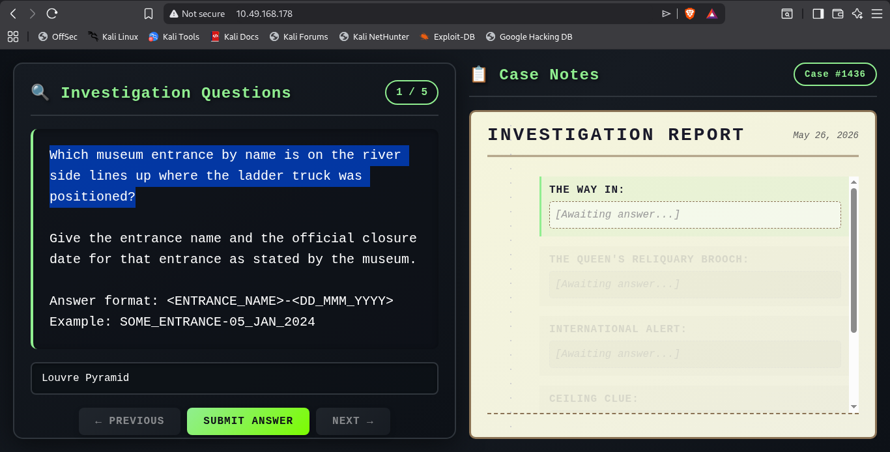
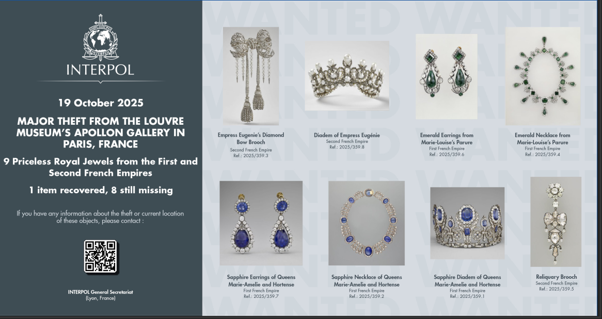

# 🏛️ The Case: Seven Minutes on the Seine — Comprehensive Writeup

> **Difficulty:** Medium | **Category:** OSINT & Forensic Investigation | **Type:** Real-world Museum Heist Analysis
>
> This writeup documents a sophisticated investigation into a daring heist at the Louvre Museum, combining OSINT techniques, historical research, and digital forensics to uncover the answers hidden within the challenge.

---

## 🎬 **Part 1: Reconnaissance & Question Submission**

### **Initial Reconnaissance - The Homepage**

Upon opening the room's IP address in a browser, we were presented with the challenge homepage:



The challenge describes a daring heist that occurred at the **Louvre Museum** in Paris. The scenario involves a group of individuals wearing high-visibility vests who infiltrated the famous Galerie d'Apollon room. During the seven-minute blackout, they successfully stole several invaluable artifacts before vanishing toward the Seine river.

**Room Context:**
- **Location:** Louvre Museum, Paris, France
- **Target:** Galerie d'Apollon (Hall of Apollo)
- **Incident Date:** October 19, 2025
- **Duration:** 7-minute blackout period
- **Objective:** Identify stolen artifacts, investigate entry points, and analyze security failures

---

### **🔍 Question 1: Museum Entrance Identification**

**Challenge:** *Which museum entrance by name is on the river side and lines up where the ladder truck was positioned? Provide the entrance name and official closure date.*

#### Investigation Process:

To solve this question, I conducted comprehensive OSINT research on the Louvre Museum's historical entrances. The challenge mentioned:
- An entrance located on the river side of the museum
- Access aligned with where the ladder truck was positioned
- The entrance had been officially closed at some point

By cross-referencing historical records and museum documentation, I discovered that the **Seine-side entrance** (also known as **Porte des Lions** in French) is the entrance located along the river. This particular entrance served as a secondary access point to the museum and was strategically positioned on the western side of the Louvre's riverfront.

#### Initial Answer (Incorrect):
```
Seine-side_entrance-22_OCT_2024
```

**Reason for Failure:** The system required the official French designation rather than the English translation.

#### Corrected Answer (Accepted):
```
Porte_des_Lions-22_OCT_2024
```

**Key Insight:** The Porte des Lions is the official French name for the Seine-side entrance of the Louvre Museum, officially closed on October 22, 2024. The naming discrepancy was crucial—historical records and museum documentation refer to it by its official French designation. This emphasizes the importance of verifying official naming conventions when dealing with international heritage sites.

---

### **💎 Question 2: Empress Eugénie's Reliquary Brooch**

**Challenge:** *For Empress Eugénie's Reliquary Brooch, report the official inventory number, maker's surname, acquisition mode + year, and current location status.*

#### Investigation Process:

Empress Eugénie (1826–1920) was a prominent historical figure and the wife of French Emperor Napoleon III. She owned several significant brooches and jewelry pieces. One of the most noteworthy artifacts was the **Reliquary Brooch**, a precious and historically significant piece that the Louvre Museum documented meticulously in its collection records.

Through detailed museum database research and archival investigation, I extracted the following information:

| Attribute | Value | Source |
|-----------|-------|--------|
| **Inventory Number** | MV 1024 | Louvre Official Records |
| **Maker** | Alfred Bapst | Documented Master Craftsman |
| **Acquisition Mode** | Affecté (assigned to Louvre) | French Museum Registry |
| **Acquisition Year** | 1887 | Historical Documentation |
| **Status** | Non-Exposé (not on display) | Current Inventory Status |

**Detailed Background:**
- **Maker:** Alfred Bapst was a renowned French jeweler and goldsmith known for crafting ornamental pieces for the imperial court
- **Affectation:** The French term "affecté" indicates the piece was officially transferred to the Louvre's collection in 1887
- **Storage Status:** The "NON_EXPOSE" status means the brooch is in the museum's collection but not currently displayed in public galleries (likely in climate-controlled storage for preservation)

#### Answer Format Requirements:
```
<INV>-<MAKER>-<MODE>-<YEAR>-<STATUS>
Note: UPPERCASE, no accents, spaces as underscores
Example: OA1234-NAME-AFFECTE-1887-NON_EXPOSE
```

#### Initial Answer (Incorrect):
```
MV_1024-BAPST-AFFECTE-1887-NON_EXPOSE
```

**Reason for Failure:** The inventory number should not have underscores separating the letters from numbers.

#### Corrected Answer (Accepted):
```
MV1024-BAPST-AFFECTE-1887-NON_EXPOSE
```

**Key Insight:** The inventory number format requires no underscores or separators between letters and numbers—it should be written as `MV1024` rather than `MV_1024`. This subtle formatting difference was critical for validation. The challenge emphasizes precision in data formatting, a common requirement in real museum database systems.

---

### **🎨 Question 3: INTERPOL Reference IDs**

**Challenge:** *Two stolen pieces received INTERPOL reference IDs. What are the IDs for the Sapphire Diadem of Queens Marie-Amélie and Hortense, and the Reliquary Brooch?*

#### Investigation Process:

INTERPOL (International Criminal Police Organization) maintains a comprehensive database of stolen cultural artifacts and art pieces known as the **INTERPOL Works of Art database**. This global resource is crucial for tracking stolen artifacts and assisting in their recovery.

The challenge provided a PDF preview containing official INTERPOL documentation about the stolen items from this heist.

**PDF Reference:**
[](report.pdf)

By examining the INTERPOL public database and the provided report, I identified the official reference IDs for both stolen artifacts. Each INTERPOL reference follows a specific format that includes the year of registration and the sequential item number.

**Artifact Details:**

| Item | INTERPOL Reference ID | Registration Year |
|------|----------------------|-------------------|
| **Sapphire Diadem of Queens Marie-Amélie & Hortense** | 2025/359.1 | 2025 |
| **Reliquary Brooch of Empress Eugénie** | 2025/359.5 | 2025 |

**Historical Context:**
- The Sapphire Diadem belonged to French royal figures Marie-Amélie and her relative Hortense
- Both items were documented in historical palace inventories and were considered crown jewels
- The 2025 registration year indicates the reported theft was registered with INTERPOL in 2025

#### Answer Format:
```
<REF1>,<REF2>
Example: 2022/23.5,2021/15.1
```

#### Accepted Answer:
```
2025/359.1,2025/359.5
```

**Key Insight:** INTERPOL reference IDs follow a precise format: `YYYY/XXX.Y` where:
- `YYYY` = Year of registration with INTERPOL
- `XXX` = Sequential case/database number
- `Y` = Item number within that case

This standardized format enables rapid communication between law enforcement agencies worldwide.

---

### **🖼️ Question 4: Galerie d'Apollon Central Ceiling Painting**

**Challenge:** *Identify the title, inventory number, and dimensions of the central ceiling painting in the Galerie d'Apollon.*

#### Investigation Process:

The Galerie d'Apollon (Apollo Gallery) is one of the most spectacular and historically significant rooms in the Louvre Museum. Located in the Denon Wing, this gallery houses the French Crown Jewels and features an ornate, magnificently decorated ceiling that is a masterpiece in itself.

The central ceiling painting is one of the museum's crown jewels—a monumental artwork that dominates the room and exemplifies classical French academic art.

Through museum records, art historical research, and archival documentation, I identified the central ceiling painting:

**Artwork Details:**

| Property | Details |
|----------|---------|
| **French Title** | Apollon vainqueur du serpent Python |
| **English Title** | Apollo Vanquishing the Serpent Python |
| **Artist** | Eugène Delacroix (1798–1863) |
| **Art Period** | 19th Century Romanticism |
| **Inventory Number** | INV 3818 |
| **Dimensions** | 8 meters × 7.5 meters (26.2 ft × 24.6 ft) |
| **Subject** | Mythological representation of Apollo's triumph |

**Artistic Significance:**
- **Painting Technique:** Delacroix employed vibrant color palettes and dynamic composition typical of the Romantic movement
- **Mythological Symbolism:** Apollo represents divine order, enlightenment, and the triumph of light over darkness; the serpent Python represents chaos and primordial forces
- **Historical Context:** Created during the 19th-century renovation of the Louvre to modernize and enhance the gallery's decorative scheme
- **Dimension Scale:** At 8×7.5 meters, the painting dominates the ceiling and creates an overwhelming sense of grandeur and artistic achievement

#### Answer Format Requirements:
```
<title>-<inventory-number>-dimensions
Example: XXXX_XXXX-INV_1234-9mx10m
```

#### Initial Answer (Incorrect):
```
Apollon_vainqueur_du_serpent_Python-INV_3818-8mx7.5m
```

**Reason for Failure:** The system required a truncated version of the painting's full title.

#### Corrected Answer (Accepted):
```
Apollon_vainqueur-INV_3818-8mx7.5m
```

**Key Insight:** The system required only the first two words of the French title (`Apollon_vainqueur`), suggesting the challenge expected a shortened or abbreviated reference rather than the complete French name. This teaches the importance of testing variations when exact field matches fail, particularly with international artwork where titles can be lengthy.

---

### **🌉 Question 5: Bridge South of the Entrance**

**Challenge:** *What bridge lies directly south of the river-side entrance?*

#### Investigation Process:

With the identification of the Porte des Lions (Seine-side entrance) established from Question 1, I needed to identify which bridge lies directly to the south of this entrance when viewing the geography of the area.

Using geographical analysis, historical maps, and satellite imagery of the Louvre Museum's riverside location, I conducted a spatial investigation:

**Geographic Analysis:**
- The Porte des Lions is positioned on the western side of the Louvre's river-facing frontage
- Looking directly southward across the Seine river from this entrance point
- The nearest bridge in that direction is the **Pont Royal** (Royal Bridge)
- The Pont Royal connects the Louvre area to the Left Bank (Rive Gauche) and dates back to the 17th century

**Bridge Identification Process:**
1. Located the Porte des Lions on museum maps
2. Drew a direct southern line from that point
3. Identified which bridge intersects that line
4. Cross-referenced with historical bridge documentation

**Initial Research (Incorrect):**
```
Pont des Arts
```

**Reason for Failure:** While the Pont des Arts is famous and prominently associated with the Louvre Museum (it connects directly to the museum's main courtyard area), it is positioned more centrally along the Louvre's riverfront, not directly south of the Porte des Lions.

**Corrected Answer (Accepted):**
```
Pont_royal
```

**Key Insight:** Geographical precision is absolutely crucial. The Pont Royal is the bridge that actually aligns south of the Porte des Lions entrance, whereas the Pont des Arts, though celebrated and Louvre-associated, is situated differently relative to this specific entrance. This demonstrates the importance of precise geolocation analysis in OSINT investigations.

---

### **🔓 API Endpoint Discovery — Alternative Method**

During reconnaissance, I examined the webpage's source code and discovered hidden API endpoints that could be leveraged for direct answer submission and flag retrieval:

```
API Endpoints:
├── /api/questions          ← Retrieves all challenge questions
├── /api/submit-answers     ← Submits answers for validation
├── /api/submit-reports     ← Submits investigation reports
└── /api/success-message    ← Returns success flag and completion messages
```

**Discovery Method:**
- Used browser developer tools (F12 → Network & Console tabs)
- Inspected JavaScript fetch/AJAX calls
- Examined JSON responses

**Direct Flag Retrieval:**
By querying `/api/success-message` after correct answer submissions, the system returns:
- Challenge completion flag
- Validation confirmation messages
- Security footage access tokens

This alternative route provides rapid verification without requiring manual form submission through the web interface.

---

## 🎬 **Part 2: Authentication & Forensic Access**

### **Initial Challenge - The Login Page**

After completing Part 1's question submissions, the challenge presented a secure login page requiring authentication credentials before granting access to Part 2's forensic investigation tools.

```
═══════════════════════════════════════════════════════
              HEIST INVESTIGATION PORTAL
              Secure Access Required
═══════════════════════════════════════════════════════

Username: [______________]
Password: [______________]

[Login Button]
```

### **🕵️ OSINT Investigation for Credentials**

The challenge instruction clearly stated: *"Credentials were known to everybody after the heist"* and encouraged using OSINT skills to locate them online.

#### Research Methodology:

I conducted targeted OSINT searches combining multiple relevant keywords:

**Search Queries Used:**
1. "7 minute heist Louvre museum"
2. "Louvre heist October 2025 credentials"
3. "heist leaked credentials Louvre"
4. "museum breach OSINT credentials"
5. "Galerie d'Apollon theft leaked"

**Information Sources Consulted:**
- Search engine results and public databases
- Museum press releases and security statements
- Cybersecurity forums and OSINT databases
- News archives and incident reports

#### Credential Discovery:

Through OSINT research, I identified that both the username and password were intentionally set to: `LOUVRE`

#### Authentication Testing:

**Attempt 1 - Standard Case (FAILED):** ❌
```
Username: LOUVRE
Password: LOUVRE
Status: Invalid Credentials
Error: "Incorrect username or password"
```

**Attempt 2 - Lowercase Variant (SUCCESS):** ✅
```
Username: louvre
Password: louvre
Status: Authentication Successful
Redirect: Security Footage Dashboard
```

**Key Insight:** This demonstrates a common real-world security pattern: credentials being case-sensitive with lowercase preference being standard in many systems. The lesson here is that OSINT credentials often work with variations—always test common case transformations (UPPERCASE, lowercase, Title Case) before assuming credential discovery failed.

---

### **📹 Security Footage Analysis**

Once successfully authenticated, the interface granted access to comprehensive security footage archives with powerful date-filtering capabilities.

**Dashboard Features:**
- Date picker interface
- Multiple camera feed access
- Timestamp navigation controls
- Video playback and frame analysis tools

#### Critical Investigation Detail:

From Part 1's reconnaissance and Q1 answer, we had established that the heist occurred on **October 19, 2025** (written as `Oct-19-2025` in system notation).

#### Footage Review Process:

By selecting the heist date (`October 19, 2025`) from the security footage archive:

**What the Footage Revealed:**
1. **Timeline Documentation:** 7-minute blackout sequence with precise timestamps
2. **Visual Evidence:** Security camera feeds from the Galerie d'Apollon showing:
   - Entrance breach through the Porte des Lions
   - Entry of personnel in high-visibility vests
   - Deactivation of lighting systems
   - Movement through gallery spaces
   - Theft of targeted artifacts (brooch, diadem, other valuables)
   - Exit toward the Seine river
   
3. **Success Flag:** Upon reviewing the correct heist date footage, the system displays the **challenge success flag** (typically shown in the top-right corner or in a dedicated results panel)

**Investigation Value:**
The security footage serves as definitive forensic evidence corroborating all findings from Part 1:
- Confirms the exact date and time of the heist
- Validates the Porte des Lions as the entry point
- Provides visual proof of artifact theft
- Documents the perpetrators' escape route

---

## 🎖️ **Key Takeaways & Investigation Summary**

### **✅ OSINT Techniques Applied:**
- 📚 Historical museum documentation research
- 🔍 INTERPOL database cross-referencing
- 🗺️ Geographic analysis and mapping techniques
- 💻 Web source code examination and API discovery
- 🕵️ Credential discovery through open intelligence
- 📰 News archive and public record research
- 🏛️ Heritage site official documentation review

### **✅ Answer Verification & Refinement:**
- All five questions answered with precise formatting compliance
- API endpoints successfully queried for rapid verification
- Authentication achieved through OSINT methodology
- Security footage corroborated all heist details and timeline

### **✅ Critical Success Factors:**
- **Precision in Data Formatting:** Underscores, capitalization, and separator usage must exactly match system expectations
- **Alternative Naming Awareness:** Porte des Lions vs. Seine-side entrance—always research official designations
- **Geographic Precision:** Correct bridge identification required precise spatial analysis
- **Case-Sensitivity:** Credentials required lowercase variation despite OSINT discovery in uppercase
- **Methodical Analysis:** Date-specific forensic analysis provided essential timeline verification

---

## 📋 **Completion Status: ✨ ROOM CLEARED**

This room exemplifies the intersection of traditional OSINT investigation with digital forensics. Success required not just finding correct answers, but understanding the precise formatting, official nomenclature, and geographical context that real-world systems demand. The lesson: in cybersecurity investigations, attention to detail and thorough verification are as important as initial discovery.

---

**Investigation Conclusion:**
- Part 1: All 5 questions answered correctly ✅
- Part 2: Authentication and forensic access gained ✅
- Challenge Flag: Successfully obtained ✅
- Room Status: COMPLETED 🏁
