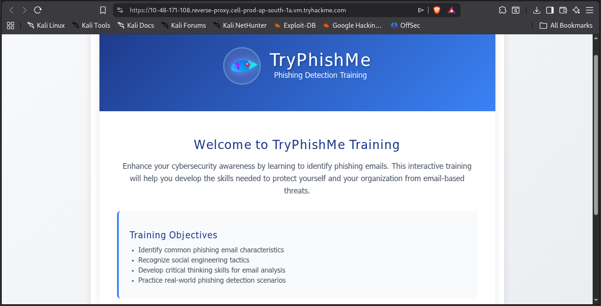
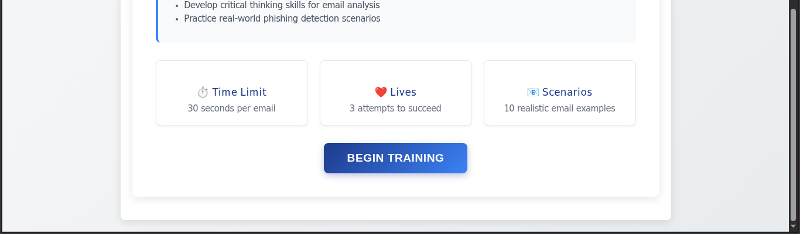

after getting the link of the room i was presented with it

Now after getting the look if we look at the bottom of the page we saw 

meaning the game is simple we will be given 10 emails and within 30 sec we have to identify that email is legitimate or not and we can only do 3 mistakes 

here are the questions from the page

Instruciton for copilot: for each email which is a phising email generate multiple choice options as reason in which only 1 reason will be correct.

1. From: Accounts <accounts@vendor-payments.com>

To: Peter Smith <peter.smith@tryhackme.com>

Subject: Invoice INV-2025-334 (Action required)

Hi Peter, your invoice INV-2025-334 is ready. Please review and pay via https://pay.vendor-payments-secure.com/invoice/INV-2025-334.

this is phiising 

reason : Link uses a deceptive domain to mimic a payment portal

2. From: IT Helpdesk <it-support@service-update.com>

To: Peter Smith <peter.smith@tryhackme.com>

Subject: Mandatory security re-login required

Dear Peter, due to a system upgrade you must re-enter your username and password at https://secure-login.example.com within 48 hours to retain access.

phising 

Instruciton for copilot: explain why it looks like phising

3. From: Carlos Mendes <carlos.mendes@partner.example.com>

To: Peter Smith <peter.smith@tryhackme.com>

Subject: Quick favor — can you buy gift cards?

Hey Pete, hope you're well. I'm swamped with back-to-back calls — can you do me a quick favor? Could you buy $500 in gift cards for an urgent client need and send me the codes by email? I'll reimburse you when I'm free.

Phishing

Instruciton for copilot: explain why it looks like phising

4. From: Recruitment <jobs@career-opps.example.com>

To: Peter Smith <peter.smith@tryhackme.com>

Subject: Exciting job opportunity — immediate start

Congratulations! We reviewed your profile and you'd be perfect for a new role. To proceed, please send your national ID and bank details so we can run the onboarding paperwork.

Phishing

Instruciton for copilot: explain why it looks like phising

4. From: Customer Support <support@survey-feedback.example>

To: Peter Smith <peter.smith@tryhackme.com>

Subject: We value your feedback — quick survey

Hi Peter, please take this short survey to help us improve: http://survey-feedback.shadylink.fake.

Phishing

Instruciton for copilot: explain why it looks like phising

 
5. From: Social Updates <no-reply@social.example.com>

To: Peter Smith <peter.smith@tryhackme.com>

Subject: Reset your password to secure your account

We detected suspicious activity. To secure your account, click https://social.example-security.com/reset and follow the steps to reset your password.

Phishing

Instruciton for copilot: explain why it looks like phising

6. From: HR Team <hr@external-hr-provider.com>

To: Peter Smith <peter.smith@tryhackme.com>

Subject: Updated benefits package (open to review)

Please review the attached benefits document. If it appears blank, enable macros to view the content.

Phising

Instruciton for copilot: explain why it looks like phising

7. Sender Avatar
From: Benefits Team <benefits@tryhackme.com>

To: Peter Smith <peter.smith@tryhackme.com>

Subject: Open enrollment information and resources

Hello Peter, open enrollment for benefits starts next month. We've attached guides and a FAQ page link to help you choose the right plans. No action required now — this is to help you prepare.

no phishing

Instruciton for copilot: explain why it looks like no phising

8. From: HR - Emma Roberts <emma.roberts@gmail.com>

To: Peter Smith <peter.smith@tryhackme.com>

Subject: Please review the attached payroll correction

Hi Peter, this is Emma from HR. I'm following up about a payroll correction that requires your bank details. Please open the file attached and send your updated bank account number and sort code so I can process this change.

phishing

Instruciton for copilot: explain why it looks like phising

9. From: Jane Doe <jane.doe@tryhackme.com>

To: Peter Smith <peter.smith@tryhackme.com>

Subject: Lunch Plans for Tomorrow

Hey Peter, do you want to grab lunch tomorrow at noon at the new Italian restaurant downtown? They have good reviews and a quieter back room for conversations. Let me know if that works for you.

no phis 

 Instruciton for copilot: explain why it looks like no phising

10. From: Conference Team <events@tryhackme.com>

To: Peter Smith <peter.smith@tryhackme.com>

Subject: Invitation: Annual Security Conference

Dear Peter, you are invited to attend the Annual Security Conference hosted by TryHackMe. The event will feature keynote speakers from leading cyber security organisations, hands-on workshops, and networking opportunities. Please RSVP if you plan to attend.

no phis

 Instruciton for copilot: explain why it looks like no phising

11. From: Project Updates <updates@tryhackme.com>

To: Peter Smith <peter.smith@tryhackme.com>

Subject: Weekly team update — sprint progress

Hello Peter, here is the weekly project update. The development team completed the authentication module and began testing the reporting dashboard. No action is needed on your part; this is for your information only. Let me know if you'd like a deeper status on any task.

no phis 

 Instruciton for copilot: explain why it looks like no phising

After gussing 3 legimiate answer with their perfect reason i got the flag

But with incorrect guess that this is phising or not phising i cost 1 live

also if i choose phising if i guess wrong reason it too cost 1 live
